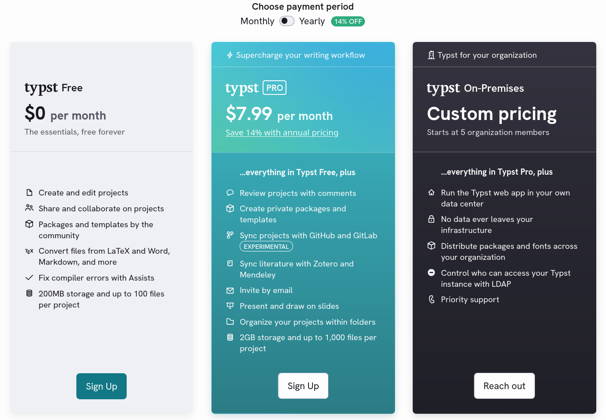

import code_embedding from "./Code_embedding.pdf"
import cboretum from "./cboretum.pdf"

When I write documentation for projects that include code, my usual approach is copying the entire project's code next to my document.
Then when I need to reference any piece of code in my document I can simply read from the files.

This keeps the files organized and I don't need to go back and copy every file or snippet which I now happen to need.
In typst this would look like this:

```typst
#import "@preview/codly:1.3.0": *
#import "@preview/codly-languages:0.1.1": *
#show: codly-init.with()
#codly(languages: codly-languages)

// A helper function that let's me embed code directly from the path
#let read_code(file_name, lang: none, ranges: none) = {
  codly(
    header: [],
    header-transform: (it => align(center)[#box(width: 80%)[*#raw(file_name)*]]),
    smart-skip: true,
    ranges: ranges
  )
  raw(read(file_name, encoding: "utf8"), block: true, lang: lang)
}

#read_code("Code/Cargo.toml", lang: "Toml")
```

This reads the code from the file, displays it, and puts it's path into the header.
Thus it would produce something like this:

<embed src={code_embedding} width="500" height="375" class="w-full mb-5"
 type="application/pdf">
</embed>

If I now need another file I just call `#read_code` with the proper path and can display that as well.

Since I started using Typst to typeset my documents, I am now also using Typst.app to collaboratively work on documents with other people.
But sadly this approach to include files doesn't work with Typst.app, because of its arbitrary file limitation.



Unless I'm an enterprise which can get the Typst.app on premises, I will be always limited in the amount of files one project can hold.
For simple documents this is fine, but when wanting to include often hundreds of source files, this is of course a problem.

## Idea one: TAR

Like any self-respecting insane person, I decided that a good solution would be to create a [tar archive](https://en.wikipedia.org/wiki/Tar_(computing)) of my code
(you know, with the whole idea of tar being a single file consisting of many) and then read my files from that during document compilation.
If that sounds like a bad idea to you, then you are clearly smarter than me.

I quickly tested if I could upload tar archives to Typst.app, which I could, and then immediately started working on a POC typst package implementation.
The idea was that I would have a function that reads the tar and returns a tree of dictionaries representing the file pathes with the file-data at the leaves.

Meaning a Tar archive containing a directory structure like this:
```
dir1
├── dir2
│   ├── file1.txt
│   └── file2.bin
├── file3.txt
└── file4.bin
```

Would return a dictionary tree structured like this
```
dir1
├── dir2
│   ├── file1.txt
│   │   └── bytes
│   └── file2.bin
│       └── bytes
├── file3.txt
│   └── bytes
└── file4.bin
    └── bytes
```

The idea was not bad but the whole thing was slow and buggy (who'd've guessed).
At some point when including too many files the compiler would outright refuse to keep compiling. Then to add insult to injury some of the tars I tried uploading were outright rejected. So I would convert the tar to base64 before uploading and then decode in the document (truly the height of jank).

So I went back to the drawing board.

## Idea two: CBOR

I checked which [file types typst actually supports](https://typst.app/docs/reference/data-loading/) and found [CBOR](https://cbor.io/).
CBOR is essentially a binary version of JSON. It trades human readability against compactedness and allows the inclusion of actual binary data[^1].
Considering how useful CBOR seems, I find it kind of weird that I had never heard of it before.

Anyhow, now that I was armed with a sufficiently powerful data container with first party support from typst, I would just have to put my files into that.
So I went the other way round and created a small CLI application that reads a directory from disk and writes its contents into a CBOR file.
I used the same tree structure like I had implemented in the tar POC.

This way I could pack a directory and it's contents into a cbor file, upload it to Typst.app, and read it using the built-in [`cbor`](https://typst.app/docs/reference/data-loading/cbor/) function.

```typst
// This cbor "archive" contains 3380 files
#let icons = cbor("icons.cbor")

// This displays the arrow down from lucide icons:
// https://lucide.dev/icons/arrow-down
#image(icons.svg.at("a-arrow-down.svg"))
```

This worked nicely! I then added a couple of features and CLI flags that would make my life easier, like:
- specifying a maximum file size for including files (we don't want to hit that 100MB file size limit)
- skipping everything that is not UTF-8 (we don't need binary files if we just want to include code)
- including the file name next to the data (so I can display the file path as well as the code)

Now I can finally go back to my standard way of including files, albeit with a few changes made:

```typst
#import "@preview/codly:1.3.0": *
#import "@preview/codly-languages:0.1.1": *
#show: codly-init.with()
#codly(languages: codly-languages)

// This time we pass the file contents manually
#let read_code(file_path, file_contents, lang: none, ranges: none) = {
  codly(
    header: [],
    header-transform: (it => [#align(center)[#box(width: 80%)[*#raw(file_path)*]] ]),
    smart-skip: true,
    ranges: ranges
  )
  raw(file_contents, block: true, lang: lang)
}

#let repo = cbor("Code/repo.cbor")

// The leaves consist of (file_path, file_contents) so spread these two
// onto the file_path and file_contents parameters using the spread syntax
#read_code(..repo.src.at("main.rs"), lang: "rust")
```

This produces the source code of my CLI app as a PDF:

<embed src={cboretum} width="500" height="375" class="w-full mb-5"
 type="application/pdf">
</embed>

Feel free to read the entire source code in the PDF, or instead check out [it's GitHub Repo](https://github.com/gelaechter/cboretum.git).

[^1]: If you want to include binary in a JSON file you will have to convert it to one of [JSON's data types](https://en.wikipedia.org/wiki/JSON#Data_types), e.g. a base64 String.
