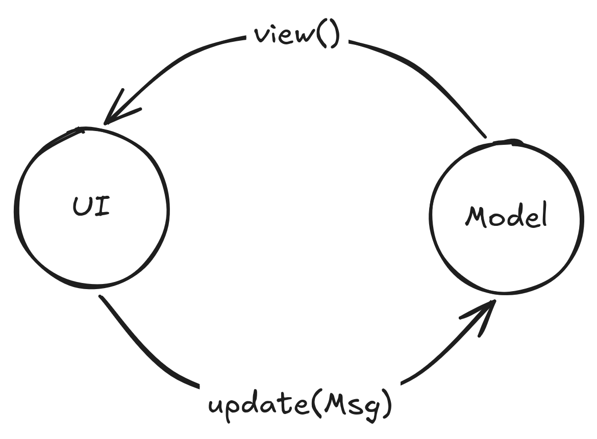

> [!IMPORTANT]
> This post was written in August 2026.
> Since Iced is still in active development and
> changing quite rapidly this post is not likely to be up to date.
> Guess you'll have to form your own opinion.

# Iced

[Iced](https://iced.rs/) is "A cross-platform GUI library for Rust focused on simplicity and type-safety. Inspired by [Elm](https://elm-lang.org/)."

Atleast that is what the GitHub repo says. Since this is a Rust library this post is written for Rust developers.
You should have at least some understanding of Rust and its features.

For the past ~5 months I've been developing a music player using it.
This music player is my go to project since forever.
I keep coming back to it ever so often I discover ✨new  and exciting™✨ frameworks, like
[Tauri](https://v2.tauri.app/),
[Leptops](https://leptos.dev/), or
[Dioxus](https://dioxuslabs.com/).

For the first time I feel like I might not get bored / fed up with it (though that is yet to see).
So, now im writing this post to tell you about why you should/shouldn't be using Iced for your next project.

# Crash Course

Before getting into why Iced is nice/ugly/whatever we should probably do a quick crash course,
to understand Iced and by extension Elm's architecture.

Elm describes itself as "A delightful language for reliable web applications."
I had not used or heard of it before using Iced,
but now that I've done my homework, it seems that Iced is essentially a rust port of the Elm model.

Elm uses a Model, View, Update (Message) architecture to build web-apps.



That means a `model` which holds the state of the app, a `view` which describes how that model should be rendered,
and an `update` function which mutates the model depending on what Messages the view emits.

Iced translates this cleanly into rust:

You have a `model`, e.g.

```rust
struct Model {
    counter: i64
}
```

which contains the state of your application.

You have a `view` function, which describes how to actually display that state to the user.

```rust
// A view function always takes the current state and
// returns an Element which describes how to render something.
// Built in Elements, you'd expect from a GUI framework, i.e. buttons,
// labels, etc, are called "widgets" in iced and coerce into Elements.
fn view(state: &Model) -> Element<'_> {
    widget::text(state.counter).into()
}
```

And you have an `update` function, which desribes how to mutate the state depending on which message it is called with.
Iced doesn't really care what a message actually looks like, but usually this is implemented through an enum:

```rust
/// The message tells the update function what to do
enum Message {
    /// Increments the counter by one
    Increment,
    /// Decrements the counter by one
    Decrement
}

fn update(state: &mut Model, message: Message) {
    // Match on message and mutate
    match message {
        Message::Increment => {
            state.counter += 1;
        },
        Message::Decrement => {
            state.counter -= 1;
        },
    }
}
```

To actually emit the messages that make changes through the update function,
you have to use widgets which do that:

```diff lang="rust" "Element<'_, Message>"
// Our Element now has a message type meaning it can emit a message
fn view(state: &Model) -> Element<'_, Message> {
    // this puts the children into a column
+    widget::column![
        // A button emits a message when pressed
+        widget::button("+").on_press(Message::Increment)
        widget::text(state.counter)
+        widget::button("-").on_press(Message::Decrement)
+    ].into()
}
```

Seeing how both `view` and `update` take `Model` as an argument, it usually makes sense to have them be methods of `Model`:

```rust
/// The message tells the update function what to do
enum Message {
    /// Increments the counter by one
    Increment,
    /// Decrements the counter by one
    Decrement
}

/// The model which holds the application state
struct Model {
    counter: i64
}

impl Model {
    // Our Element now has a message type meaning it can emit a message
    fn view(&self) -> Element<'_, Message> {
        // this puts the children into a column
        widget::column![
            // A button emits a message when pressed
            widget::button("+").on_press(Message::Increment)
            widget::text(self.counter)
            widget::button("-").on_press(Message::Decrement)
        ].into()
    }

    fn update(&mut self, message: Message) {
        // Match on message and mutate where it makes sense
        match message {
            Message::Increment => {
                self.counter += 1;
            },
            Message::Decrement => {
                self.counter -= 1;
            },
        }
    }
}
```

Congratulations, you have everything you need for your application. Time to run it:

```rust
// Runs the application with the view as root
// and the update function to mutate the state
iced::run(Model::view, Model::update)
```

You are now a certified iced-expert™

# The good

Iced has a lot of good parts. Like the fact that it is inspired by:

## Elm


## It's fast!

# Im cheating