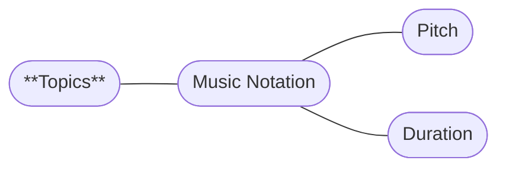

# Prelude

Do you want to get into making music and don't know where to start?

In this series of posts I am going to try my best to get you introduced to music creation.
I will teach you the basics of music theory

Let it be said that music theory has a long history and,
as with all things that developed organically, is not always logical.
But worry not, we will start from zero and then hopefully
get to you writing your first little pieces of music.

> [!TIP]
> Want to get started right away? [Click here!](/posts/lmm-01-pitch)

## Topics covered

I hope to keep this mind map up-to-date to give you an idea of what this series currently covers:

