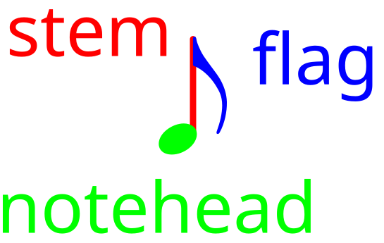

import ScorePlayer from "./ScorePlayer.astro"

Music notation allows you to read and write down music.
Through music notation we can communicate musical ideas and concepts, so we can learn from them.
That way we can apply these ideas ourselves and write music.
So let's get started with the basics!

### Duration

Duration or the **note value** describes how short or long a sound is. Notes show their duration through three parts:

  - their head (the circle part), and if it is filled,
  - their stem (the vertical line), or lack thereof
  - and flags on the stem

These notes are ordered longest to shortest:

<ScorePlayer filename="full_note"></ScorePlayer>

<ScorePlayer filename="half_note"></ScorePlayer>

<ScorePlayer filename="quarter_note"></ScorePlayer>

<ScorePlayer filename="8th_note"></ScorePlayer>

<ScorePlayer filename="16th_note"></ScorePlayer>

<ScorePlayer filename="32nd_note"></ScorePlayer>

<ScorePlayer filename="64th_note"></ScorePlayer>

> [!TIP]
> Wait for one note to finish playing before listening to the next to actually hear the difference in duration

Looking at the names of those notes "full", "half", "quarter", "8th", etc. you might have noticed that they describe fractions.
"Full" being a whole $\frac{1}{1}$ note, "half" being, well... one half $\frac{1}{2}$, quarter being, a fourth $\frac{1}{4}$ and so on.
If you now listen back to the notes again you might actually **hear** that the half note is exactly half as long as the full note.
