import { Code } from 'astro-expressive-code/components'
import source from 'steam_totp.html?raw';

<style>
{`
    img, iframe { max-height: 25em; width: auto; }
    table { margin: 0px auto; width: fit-content; }
`}
</style>

*In this post I describe how I created a Steam Guard TOTP authenticator webpage. Thus allowing me and others to easily share a Steam account.*

## The Problem

Steam is a distribution service for video games by the company Valve. It acts as a shop, launcher and additionally as a social media platform for video games.


All the games you buy on Steam are bound to your Steam account.
If your friends want to play a game they have to buy the game on their own Steam account, or need to *have access to a Steam account that already owns it*.

Steam allows you to create a Steam family, a group of up to 6 people where each of them share the games they bought.
I, like many others, have set up a Steam family with four of my friends.
This way we have a pretty large library of games for each of us to play. If we now want to grant anyone else access to this library we have two options:

1. **Add them to the library.** This has the caveat that the slot they now occupy gets a 1-year cooldown.
Meaning that if they leave the family again another user can't be added to the Steam family for one whole year.
This is obviously being done to prevent exactly this behavior.

2. **Give them access to one of the accounts of the 5 core users.**
This has the caveat of granting someone full access to one of our Steam accounts. They are firstly filled with our personal data and secondly cannot be used simultaneously.
While a Steam account is playing a game it cannot be used to play something different at the same time.

The solution to the problem we chose was to **create an account specifically for accessing the library**.
This way anyone with access to this library account can use the whole library without us giving away access to any of our *private* Steam accounts.

While the blocking problem persists and the account can only be used by one person to play games at a time, this is usually enough for situations like wanting to play single-player games or wanting to play together with someone else for an evening.

The problem this blog post solves is **the issue of authentication**. To log into a Steam account you use a username and a password. But Steam also additionally requires a second factor. This second factor can be one the following:

- A code that is received via E-Mail (*the default method*)
- A code that is received via SMS
- A QR that can be scanned with the Steam App
- Or a Timed One Time Password (TOTP) that is displayed inside the Steam App

So while the username and password are easily shared, **also granting access to this second factor is the problem to be solved**.

## The solution

I thought about possible ways to do this. First I considered periodically querying the E-Mail account for new messages and posting them in some of our communication channels.
I quickly reconsidered though after trying out some E-Mail clients for the command-line (specifically *getmail* and *fetchmail*).
Too much configuration and reading man pages for something that I want to bodge together in an afternoon.

### Going web

So, being lazy, I went for creating a website. Creating a website allows me to use JavaScript, and JavaScript has two very important features for lazy people:

1. having an NPM package for pretty much everything

2. being well "understood" by LLMs

Besides, a website is also an easily accessible way for everyone to access the TOTP as everyone already has a browser and knows how to open websites.

So, I went to [NPM](https://www.npmjs.com/) and typed "steam" into the search bar hoping for the best.
The fourth result showed *steam-totp*, its description reading "*Generate Steam-style TOTP codes given a secret*":

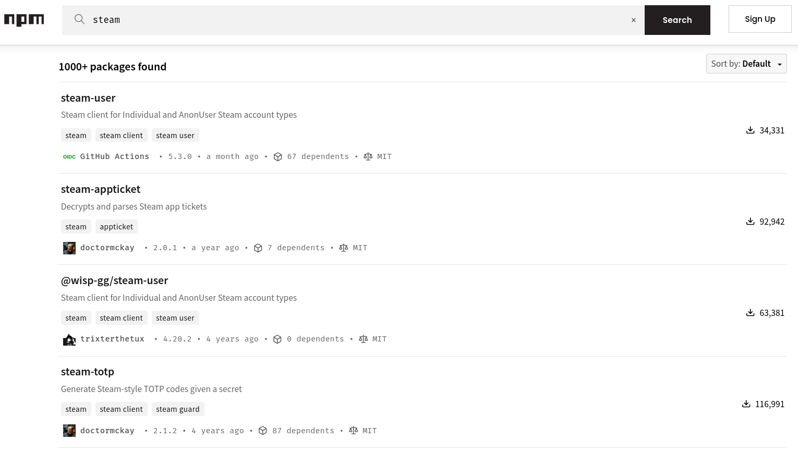

This was exactly what I needed. The first feature of JavaScript doing some major lifting once again
 Using this I could create a simple webpage that always displays the TOTP for the library account and I wouldn't even have to deal with the cryptography behind it.

So I visited [steam-totp's GitHub repository](https://github.com/DoctorMcKay/node-steam-totp) and was pleasantly surprised to see that the whole module was just a single *index.js* file.
It uses NodeJS' crypto module to calculate the TOTP for a hardcoded **shared secret**.

Next I copied the link to the *index.js* and put the following prompt into my LLM:

> Create a single file webpage (html, css and js) that displays a Steam TOTP using https://raw.githubusercontent.com/DoctorMcKay/node-steam-totp/refs/heads/master/index.js

It churned a little until it finally spit out a single file website. I opened it in the browser and was greeted by this:

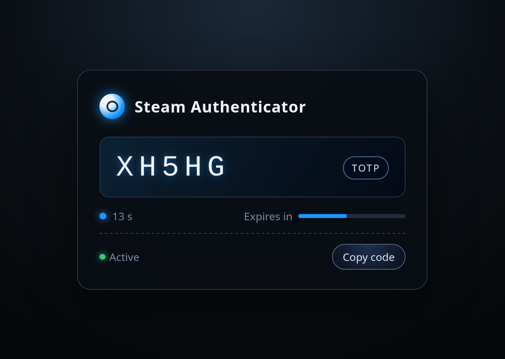

The capabilities of LLMs are quite astonishing every now and then. Especially when it comes to working with things which their datasets contain a million times.
I then told it to make some more tweaks, like making the page responsive for larger screens. Though some of these were too much for it, meaning I made the final changes by hand until I was satisfied:

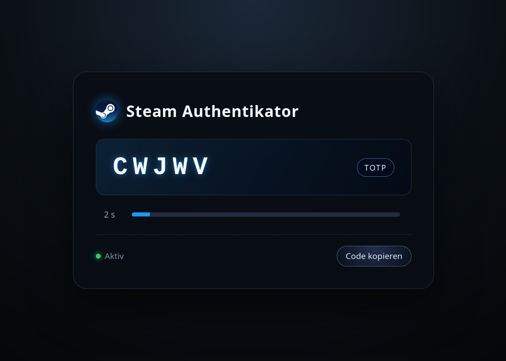

This whole process from start to finish took me about 30 minutes. I felt mighty satisfied with this approach and how little effort it actually took.
Now I just had to get the shared secret of the library account and replace the example secret in the HTML file. How hard could it be?

### Getting a Steam TOTP shared secret

It turns out that this was to be the hardest part of my endeavor.
Usually when setting up two-factor authentication with a TOTP the provider gives you the shared secret so you can put it into an authenticator App like Google Authenticator or [Aegis](https://getaegis.app/).
Valve, probably wanting to prevent automating logins to Steam accounts or setups such as the library account, do not give you access to the TOTP's shared secret.
The shared secret is embedded inside the Steam App, with no easy way to extract it.

So after looking through a few Reddit threads describing ways to extract the shared secrets through exploits in older version of the Steam app,
I finally stumbled upon [a GitHub discussion in the KeepassXC Repo](https://github.com/keepassxreboot/keepassxc/discussions/9591) discussing that exact problem.
Inside that discussion [another one](https://github.com/JustArchiNET/ArchiSteamFarm/discussions/2786) was linked as the solution.
That discussion quoted a paragraph which described the solution I ultimately chose:

> 07/17/2023 Try https://github.com/YifePlayte/SteamGuardDump, an xposed plugin to dump steam guard.

So what I had to do was:

1. Install the Steam App on a rooted Android device
2. Set that installed App as the Steam authenticator
3. Install the SteamGuardDump Xposed module to dump the shared secret

#### Getting a rooted Android Device

I did not have a rooted device to hand ,so I used [Android Studio to create an Android Virtual Device](https://developer.android.com/studio/run/emulator#avd) (AVD) which I could then root.

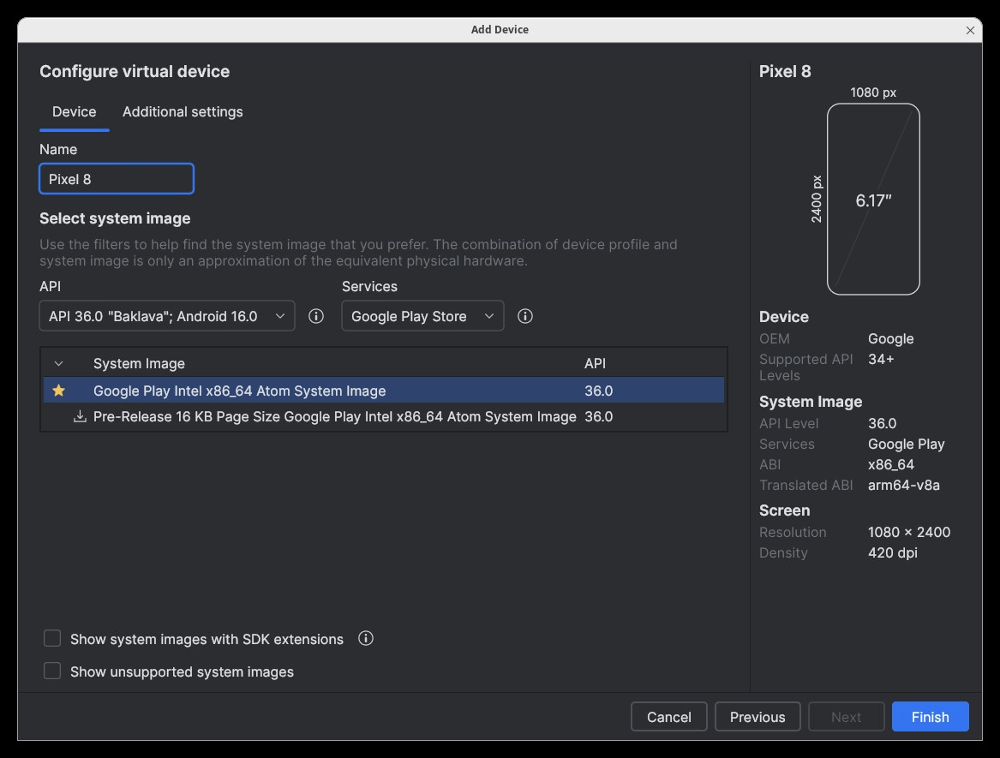

I booted the AVD and went to look for ways to root it and found the [rootAVD](https://gitlab.com/newbit/rootAVD) script which simplifies the whole rooting process for AVDs.
Perfect! After reading rootAVD's README I now knew the following:

- rootAVD installs [Magisk](https://github.com/topjohnwu/Magisk), an Android root installer and manager
- I could list available rooted system-images by executing the script with the `ListAllAVDs` argument
- Android Versions ≥ 14 need Magisk Version ≥ 26.x
- Magisk Versions ≥ 26.x in turn requires the use of a [fake BOOT.img](https://github.com/newbit1/rootAVD?tab=readme-ov-file#fake-bootimg-function)

So I cloned the repository, opened a terminal inside it and executed the script with the `ListAllAVDs` argument.
It showed usage instructions for rootAVD and listed all possible images for my AVDs:

```ansi del="[70 lines omitted]"
gelaechter@Arch ~> git clone https://gitlab.com/newbit/rootAVD.git
Cloning into 'rootAVD'...
remote: Enumerating objects: 563, done.
remote: Counting objects: 100% (50/50), done.
remote: Compressing objects: 100% (26/26), done.
remote: Total 563 (delta 32), reused 39 (delta 24), pack-reused 513 (from 1)
Receiving objects: 100% (563/563), 72.46 MiB | 53.15 MiB/s, done.
Resolving deltas: 100% (344/344), done.
gelaechter@Arch ~> cd rootAVD/
gelaechter@Arch ~/rootAVD (master)> ./rootAVD.sh ListAllAVDs
rootAVD A Script to root AVD by NewBit XDA

[70 lines omitted]

Command Examples:
./rootAVD.sh
./rootAVD.sh ListAllAVDs
./rootAVD.sh InstallApps

./rootAVD.sh system-images/android-36/google_apis_playstore/x86_64/ramdisk.img
./rootAVD.sh system-images/android-36/google_apis_playstore/x86_64/ramdisk.img FAKEBOOTIMG
./rootAVD.sh system-images/android-36/google_apis_playstore/x86_64/ramdisk.img DEBUG PATCHFSTAB GetUSBHPmodZ
./rootAVD.sh system-images/android-36/google_apis_playstore/x86_64/ramdisk.img restore
./rootAVD.sh system-images/android-36/google_apis_playstore/x86_64/ramdisk.img InstallKernelModules
./rootAVD.sh system-images/android-36/google_apis_playstore/x86_64/ramdisk.img InstallPrebuiltKernelModules
./rootAVD.sh system-images/android-36/google_apis_playstore/x86_64/ramdisk.img InstallPrebuiltKernelModules GetUSBHPmodZ PATCHFSTAB DEBUG
./rootAVD.sh system-images/android-36/google_apis_playstore/x86_64/ramdisk.img AddRCscripts
```

Since I need to use a fake BOOT.img I copied the line with the `FAKEBOOTIMG` argument and ran it.
The rootAVD script then asked me to select a Magisk version. Since I use Android ≥ 14 I chose the stable version (30.6) by entering <kbd>2</kbd> :

```ansi del="[35 lines omitted]"
gelaechter@Arch ~/rootAVD (master)> ./rootAVD.sh system-images/android-36/google_apis_playstore/x86_64/ramdisk.img FAKEBOOTIMG
[!] and we are NOT in an emulator shell

[35 lines omitted]

[!] AVD is online
[!] Checking available Magisk Versions
[?] Choose a Magisk Version to install and make it local
[s] (s)how all available Magisk Versions
[1] local stable '26.4' (ENTER)
[2] stable 30.6
[3] canary 30.6
2
```

The script downloaded version 30.6 of Magisk, opened the Magisk App in the emulator and prompted me to install the fakeboot.img file from the SD Card:

```ansi del="[50 lines omitted]"
[-] You choose Magisk stable Version 30.6
[*] Deleting local Magisk '26.4'
[*] Downloading Magisk stable 30.6
[!] Downloading Magisk stable 30.6 complete!

[50 lines omitted]

[-] Starting Magisk
[*] Install/Patch /sdcard/Download/fakeboot.img and hit Enter when done(max. 60s)
```
In the Magisk App I now had to click on *Install* to start the permanent installation of Magisk.
Normally when using a fake BOOT.img you'd follow the instructions given by the script, selecting the fakeboot.img in the Downloads folder but that didn't work for me the first time.
So instead I tried direct mode which worked without any problems. If you're replicating this setup you'll maybe have to try both.

|                                        |                                      |
| -------------------------------------- | ------------------------------------ |
| 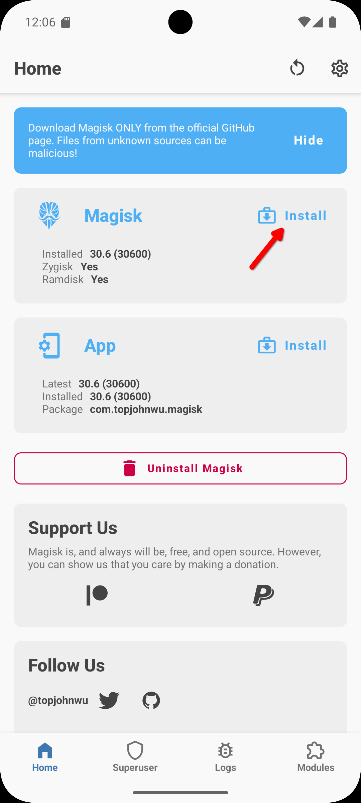 | 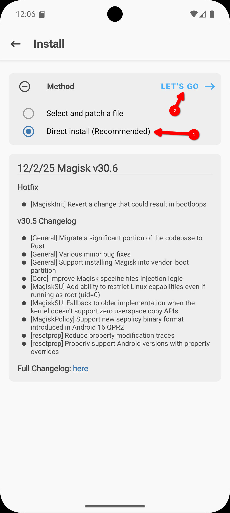 |

Now the AVD was rooted and Magisk installed. Zygisk was also automatically activated which is important because Zygisk allows rooted programs to access running Apps:

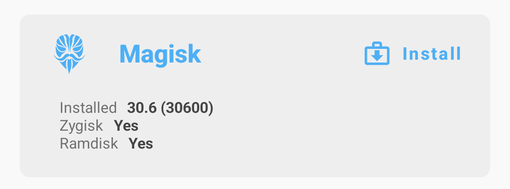

Now the AVD is rooted, great! Next I installed the Steam App:

```ansi
gelaechter@Arch ~/rootAVD (master)> wget -q --show-progress https://media.steampowered.com/apps/steam-android/steam-3.10.6.apk
steam-3.10.6.apk                            100%[=========================================================================================>] 117.80M  61.5MB/s    in 1.9s    
gelaechter@Arch ~/rootAVD (master)> adb install steam-3.10.6.apk 
Performing Streamed Install
Success
```

Then I went through the whole authenticator setup which is documented on Steam's [Support page](https://help.steampowered.com/en/faqs/view/6891-E071-C9D9-0134).
Nice, now I have a working Steam authenticator on a rooted Android phone. Now I want to dump its credentials using SteamGuardDump, but that requires LSPosed, so I'll have to install that first.

*What is that?* LSPosed is a module for Magisk that provides apps like SteamGuardDump an easy way to manipulate Apps using Zygisk.[^1]
Since I am using Android 16, I'll have to use [JingMatrix's fork of LSPosed](https://github.com/JingMatrix/LSPosed) since the original only supports up to Android 14.

So I downloaded the latest LSPosed module and uploaded it into the Downloads folder of the emulator:

```ansi
gelaechter@Arch ~/rootAVD (master)> wget -q --show-progress https://github.com/JingMatrix/LSPosed/releases/download/v1.10.2/LSPosed-v1.10.2-7182-zygisk-release.zip
LSPosed-v1.10.2-7182-zygisk-release.zip. 100%[=================================================================================>]   6.21M  --.-KB/s    in 0.1s
gelaechter@Arch ~/rootAVD (master)> adb push LSPosed-v1.10.2-7182-zygisk-release.zip /storage/emulated/0/Download
LSPosed-v1.10.2-7182-zygisk-release.zip: 1 file pushed, 0 skipped. 37.0 MB/s (6507377 bytes in 0.168s)
```

Now I could install the LSPosed module in the Modules tab inside the Magisk App by:

- Pressing "Install from Storage"
- Selecting the LSPosed module from the Downloads directory
- Confirming the installation
- Rebooting after the installation was finished

|||
|---|---|
| 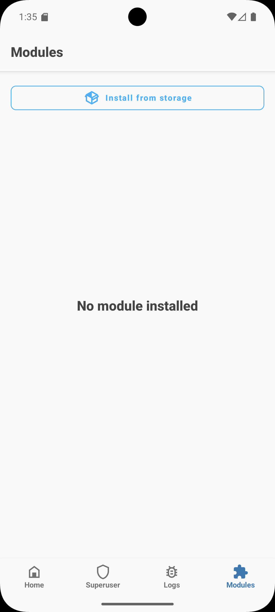 |  |

|||
|---|---|
| 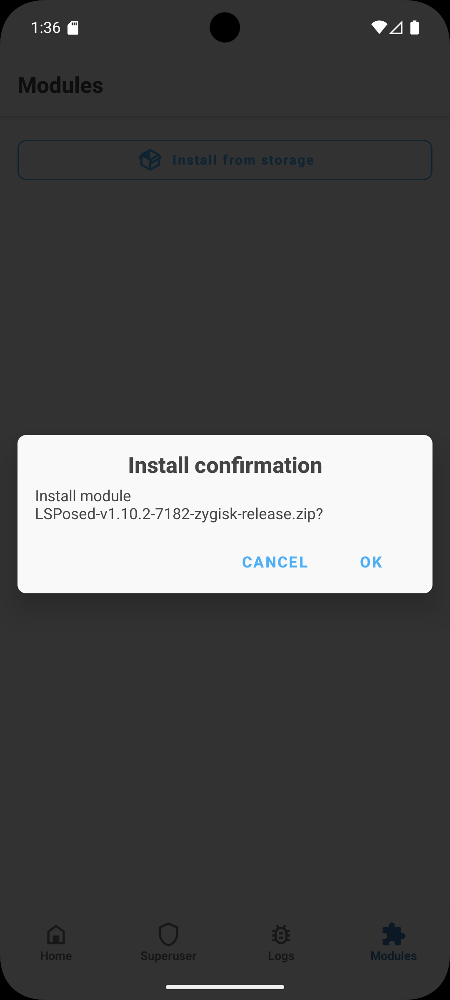 | 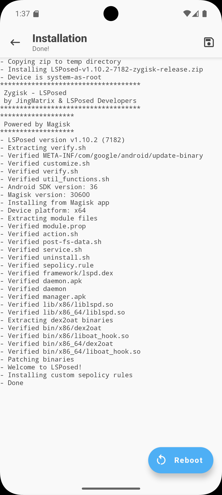 |


After LSPosed was installed I installed SteamGuardDump:

```ansi
gelaechter@Arch ~/rootAVD (master)> wget -q --show-progress https://github.com/YifePlayte/SteamGuardDump/releases/download/1.3.2/SteamGuardDump-1.3.2.apk
SteamGuardDump-1.3.2.apk                    100%[=========================================================================================>] 321.08K  --.-KB/s    in 0.03s
gelaechter@Arch ~/rootAVD (master)> adb install SteamGuardDump-1.3.2.apk 
Performing Streamed Install
Success
```

I now needed to activate Steam Guard dump in LSPosed an grant it access to Steam, the System and Magisk.
To do that I:
- Opened the notifications and clicked the LSPosed notification to open the manager
- Went to the Modules tab and clicked the disabled SteamGuardDump module
- Enabled the module and granted access to Steam, System and Magisk
- Finally, I rebooted by clicking reboot in the Toast

|||
|---|---|
| 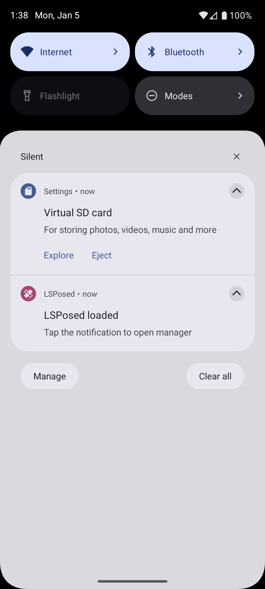 | 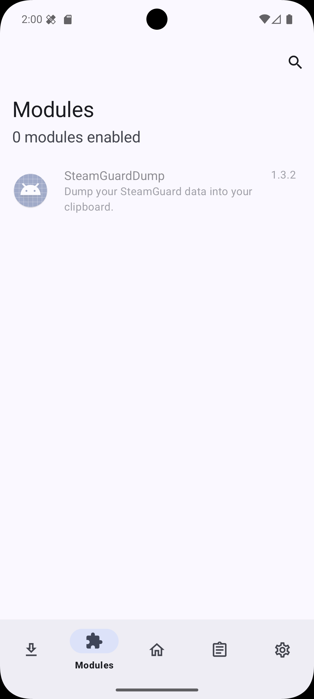

|||
|---|---|
| 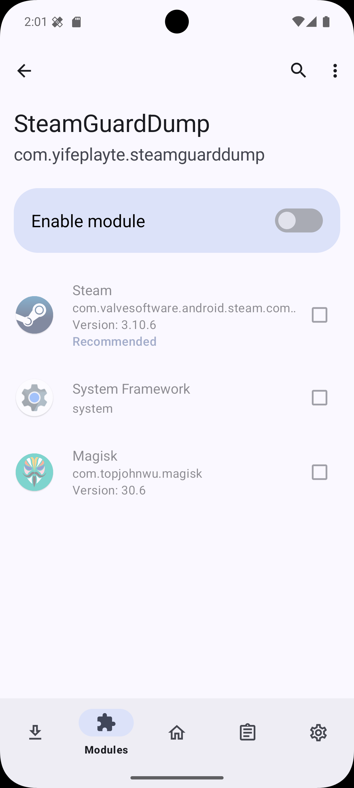 | 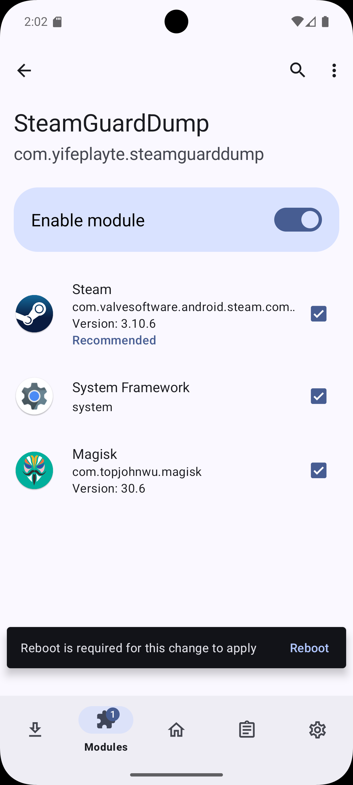 |

After the AVD rebooted one final time, SteamGuardDump is now active.
Now when opening the Steam App the SteamGuard data is getting automatically dumped to the clipboard:

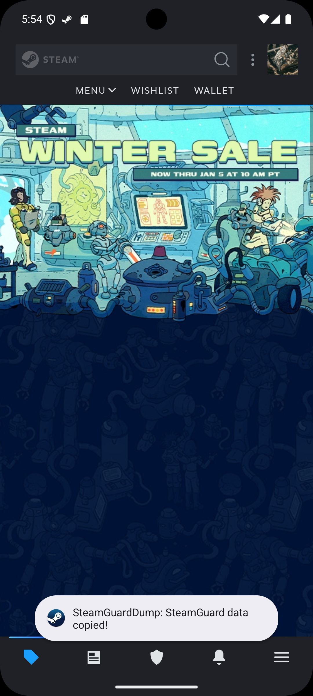

I could now paste the contents into a file:\
(*These are redacted contents not the actual dump*)

```json
{
  "accounts":
    {
      "76561198751234567":
        {
          "shared_secret": "Xp9Z41ABK/M7cYVr9nC/mvtu/Fs=",
          "identity_secret": "gH8WQ76Lr/F7u1B6Wem6gDSRZn9=",
          "secret_1": "2Qbz1sTJpe+cQrIjUJYF2RWZuvY=",
          "serial_number": "1234567890123456789",
          "revocation_code": "R04567",
          "account_name": "example_account",
          "token_gid": "12345abcde67890f",
          "confirm_type": 3,
          "uri": "otpauth://totp/Steam:example_account?secret=K4D92F41FET8LOTROWVPAZ8NPKJH57V4&issuer=Steam"
        }
    },
  "uuid_key": "android:67abc89c-1234-4567-8910-23456789abcd"
}
```

I put the shared secret into the SHARED_SECRET field of the website, and it worked without any problems.
The website showed the correct TOTP and JavaScript's second feature proved itself.
The code the LLM wrote worked.

I finally hosted the file as a [CloudFlare Page](https://pages.cloudflare.com/) since CloudFlare already manages my DNS records which easily allows me to set up the page as part of my domain.
Now I can share the URL together with the username and password and anyone can at any time log into the account themselves.

Here is the final result:\
(*Still redacted, not the actual website*)

<figure>
  <iframe
    srcdoc={source}
    style="border:0; width: 100%; height: 400px"
  ></iframe>
</figure>

<br/>

:::fold[Expand this if you wish to see the full source code]
<Code code={source} lang="html" />
:::

## A word on security

This whole thing is incredibly stupid from a security standpoint.
While it may not be trivial to link the library account to me and the Steam TOTP website I made, this is still a *secret* that I've hardcoded plainly readable into the website.
Doing this I am effectively erasing the second factor. Given that I don't really care what happens to the library account that isn't really a problem to me.
**But don't ever do this for any account you care about**. We use multifactor authentication for a reason.

[^1]: This is a gross oversimplification 