<style>
{`
    img, iframe { max-height: 60vh; width: auto; }
    table { margin: 0px auto; width: fit-content; }
`}
</style>

> [!NOTE]
> I never finished my analysis and hence this post. I now decided to publish it anyways, so that if anyone
> happens to get their Go programs flagged they can stumble upon this and get a better idea why.
>
> :::fold[TLDR]
> The current evidence pretty much points towards false positives.
> There doesn't seem to be malware in the Go runtime or toolchain.
> (Though I can't say for sure, since well... see above)
> :::

## The issue

During work on a Go project, a simple Windows Go executable ended up being submitted to the malware scanners VirusTotal and MetaDefender.
To our surprise both scanners reported multiple malicious-flags.
Suspicious properties like high entropy, containing cryptographic primitives or making network calls were found.

This was weird for multiple reasons:

- This behaviour could only be reproduced for Windows executables. Linux executables were not flagged at all.
- This behaviour was consistent for any freshly compiled Windows executable indepedent of compilation environment, meaning we could rule out malicious modification of our executable after compilation.
- This behaviour is consistent for even the simplest of Go programs. No extra imports required.

The question is now, what causes these flags and behaviour reports? Did we find malware in the Go toolchain?

## Reproducing the scans

First off, lets start with reproducing the scans.
This is a simple "Hello World" program in Go:

```go
package main

func main() {
    print("hello world!")
}
```

### Environment

We compile our executable using the Go toolchain on a Linux system.
Since the Go toolchain contains compiler, assembler and linker we don't need to check any other dependencies of our system.

```console
$ go version
go version go1.24.3 linux/amd64

$ go tool compile -V
compile version go1.24.3

$ go tool asm -V
asm version go1.24.3

$ go tool link -V
link version go1.24.3
```

### Linux executables

Now, lets start with building a Linux executable and checking if the malware scanners flag our executable:

```zsh
# Produces a main.elf Linux executable
$ go build -o main.elf main.go
```

When uploading this binary to both malware scanners neither of them show any malware-flags:

|                                                                                                                                                                                                                      |                                                                                                                                                                                                                                         |
| -------------------------------------------------------------------------------------------------------------------------------------------------------------------------------------------------------------------- | --------------------------------------------------------------------------------------------------------------------------------------------------------------------------------------------------------------------------------------- |
| 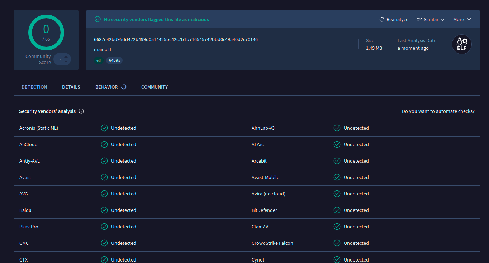 <br/> [The VirusTotal scan](https://www.virustotal.com/gui/file/6687e42bd95dd472b499d0a14425bc42c7b1b716545742bbd0c49540d2c70146)  showing 0/65 flags | 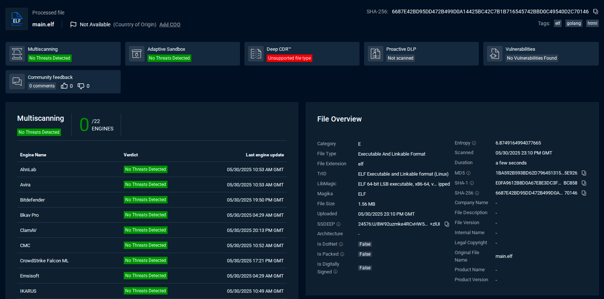 <br/> [The MetaDefender Cloud scan](https://metadefender.com/results/hash/6687E42BD95DD472B499D0A14425BC42C7B1B716545742BBD0C49540D2C70146) showing 0/22 flags |

### Windows executables

Now let's build an executable for Windows and check if the malware scanners flag it:

```bash
# Produces a main.exe Windows executable
$ GOOS=windows GOARCH=amd64 go build -o main.exe main.go
```

This time both malware scanners flag the executable:

|                                                                                                                                                                                          |                                                                                                                                                                                                                                           |
| ---------------------------------------------------------------------------------------------------------------------------------------------------------------------------------------- | ----------------------------------------------------------------------------------------------------------------------------------------------------------------------------------------------------------------------------------------- |
| 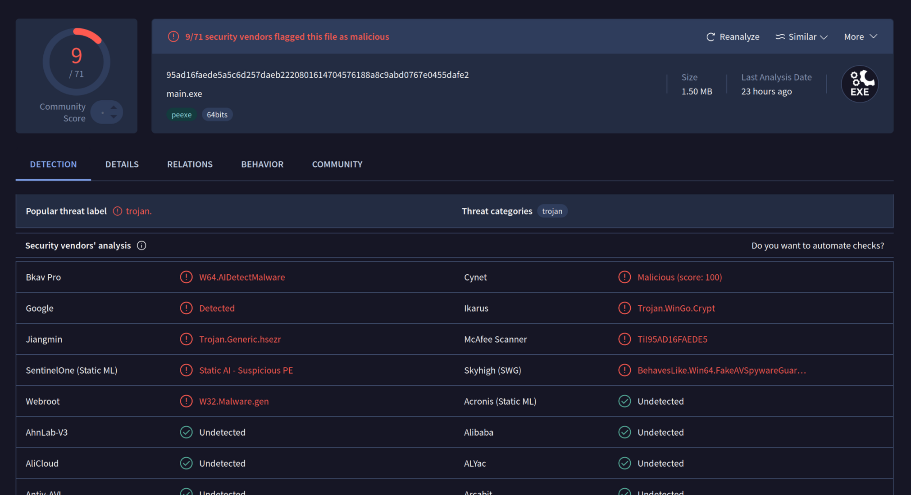 <br/> [The VirusTotal scan](https://www.virustotal.com/gui/file/95ad16faede5a5c6d257daeb2220801614704576188a8c9abd0767e0455dafe2) showing 9/71 flags | 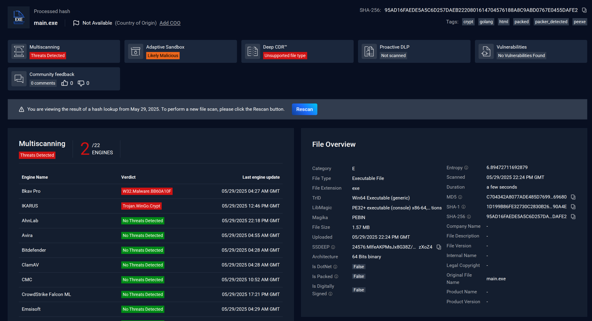 <br/> [The MetaDefender Cloud scan](https://metadefender.com/results/hash/95AD16FAEDE5A5C6D257DAEB2220801614704576188A8C9ABD0767E0455DAFE2) showing 2/22 flags |

We found the following warnings of the scans especially interesting:

| Warning                                                                                                                                                                                                                                       | Screenshot                                |
| --------------------------------------------------------------------------------------------------------------------------------------------------------------------------------------------------------------------------------------------- | ----------------------------------------- |
| **High entropy (Meta Defender)** <br/> The executable contains sections with high entropy. This usually suggests encryption to make reverse-engineering / understanding it harder.                                                             | 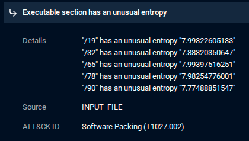     |
| **Obfuscated Files or Information (VirusTotal)** <br/>The executable contains cryptographic-primitives like RC4 or AES. This would again suggest encryption of our binary.                                                                     | 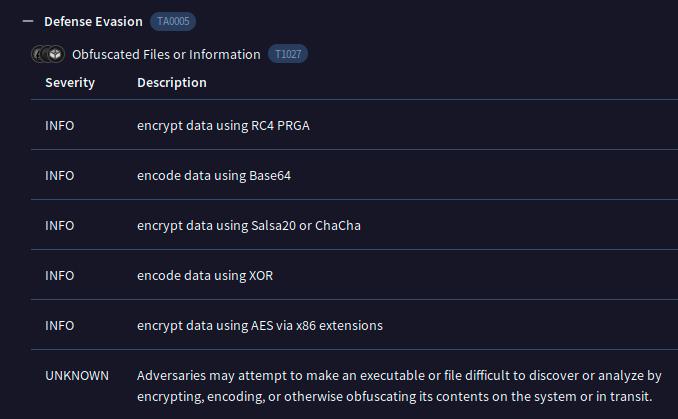 |
| **Virtual Machine detection (VirusTotal)** <br/>The executable seems to contain strings related to the detection of virtual machines. This is usually done to detect the usage of Sandboxes. This way malware doesn't trigger during analysis. | 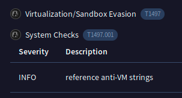     |
| **Installation of a Google Updater? (VirusTotal)** <br/>The executable seems to drop files inside the Google Updater directory. This suggests that malware is installed.                                                                       | 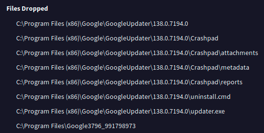    |

In the following chapters we are going to have a look at these warnings and their cause:

## High Entropy

The first warning are high entropy sections in the executable, which often suggests encrypted data. Malicious actors would do this to hide bad code.

### Comparing Windows and Linux

The first thing we can do is simply compare the entropy of our Windows/Linux executables. Maybe our Linux executable doesn't contain any of these sections since it didn't raise any flags. To do that we use the [ImHex hex editor](https://github.com/WerWolv/ImHex) which provides tools for reverse engineering. The *Data Information* View for example can visualize the Shannon entropy of our binary.

This graph shows the entropy of our **Windows executable**:
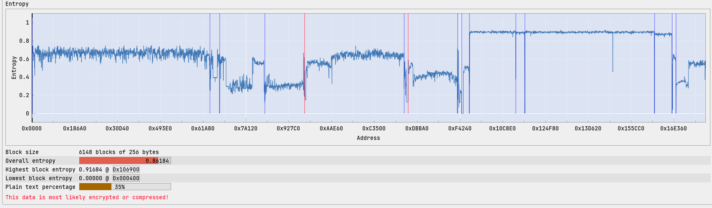

This graph shows the entropy of our **Linux executable**:
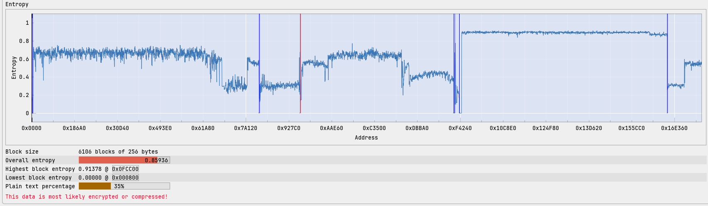

We immediately see that both of our binaries have sections of high entropy distributed in the same manner. So the existence of high entropy sections is not exclusive to the Windows executable. It simply appears to not be deemed dangerous for the Linux executable.

### Analysis of high entropy sections

MetaDefender explicitly names the following executable sections for having unusually high entropy:

- `/19`
- `/32`
- `/65`
- `/78`
- `/90`

We can use the pattern analysis system of ImHex to find these sections in our binary.
To do that we first load the `Microsoft PE Portable Executable` pattern in the *Pattern Editor* view and the start the pattern evaluation.

We are now shown information in the *Pattern Data* view:
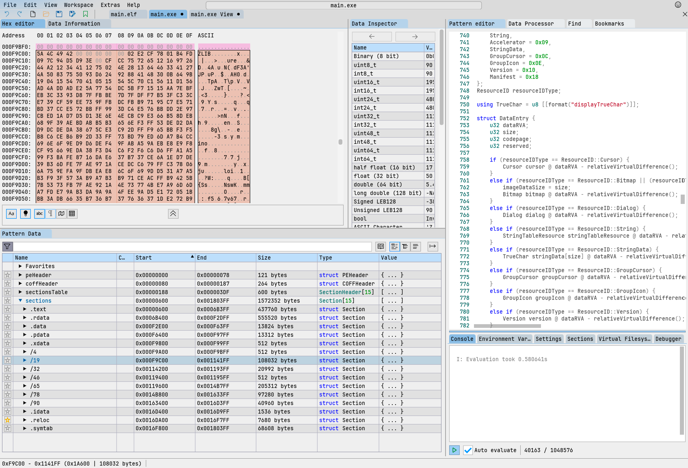

Upon closer inspection we see that all our marked sections `/19`, `/32`, `/65`, `/78`, `/90` start with the ASCII symbols `ZLIB`. Meaning these sections are probably ZLIB compressed data which would explain the high entropy.
Looking past the first 12 Bytes we can see a ZLIB magic header `0x78 0x01` which signifies low or no compression. If we use Ghidra and have a look at these sections in the *Memory Map* view we see that Ghidra has assigned our sections proper names:

|                                                                                                                                     |                                                                                                                                            |
| ----------------------------------------------------------------------------------------------------------------------------------- | ------------------------------------------------------------------------------------------------------------------------------------------ |
| 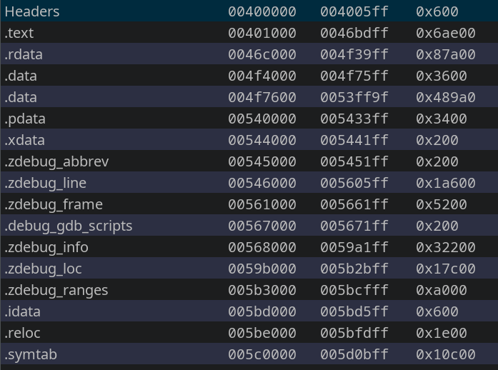 <br/> The memory map view. It shows us the executable sections and their respective address ranges. | 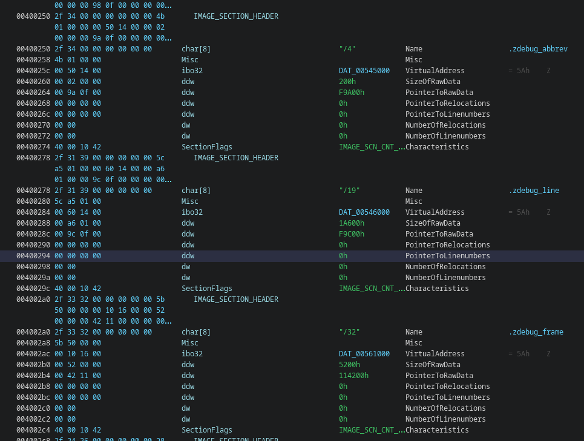 The image section headers of our Windows executable. We can see the actual and assigned names. |

So our sections are actually named the following:

- `.zdebug_line`
- `.zdebug_frame`
- `.zdebug_info`
- `.zdebug_loc`
- `.zdebug_ranges`

After looking them up we find that these section names are part of the DWARF debugging data format, meaning this is debug data for the executable:[^1]

| .debug_abbrev | Abbreviations used in the .debug_info section        |
| ------------- | ---------------------------------------------------- |
| .debug_line   | Line number information                              |
| .debug_frame  | Call frame information                               |
| .debug_info   | Core DWARF information section                       |
| .debug_loc    | Location lists used in the DW_AT_location attributes |
| .debug_ranges | Address ranges used in the DW_AT_ranges attributes   |

The "z" prefix suggests that they are compressed using ZLIB.

### Disabling debug symbols

Since we now know that the source of our unusually high entropy are debug symbols, we can simply disable them when building:

```bash
# Produces a sans_debug.exe Windows executable without debug symbols
$ GOOS=windows GOARCH=amd64 go build -ldflags "-s -w" -o sans_debug.exe main.go
```

Now we can compare our binary's entropy **with debug symbols (main.exe)**:


And **without debug symbols (sans_debug.exe)**:
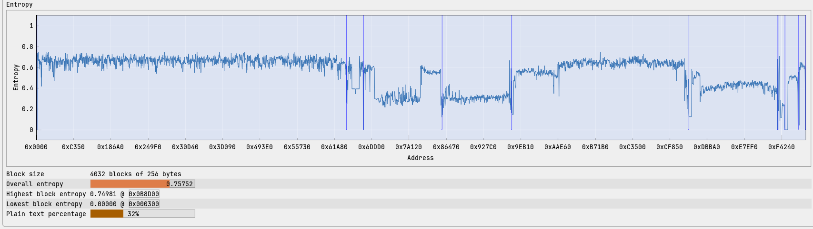

We see that the high entropy block starting around `0xF4...` in main.exe is missing in sans_debug.exe. If we upload sans_debug.exe into the malware scanners we see that some of the malicious-flags, have disappeared:

|                                                                                                                                                                                                                                     |                                                                                                                                                                                                                                                 |
| ----------------------------------------------------------------------------------------------------------------------------------------------------------------------------------------------------------------------------------- | ----------------------------------------------------------------------------------------------------------------------------------------------------------------------------------------------------------------------------------------------- |
|  [The VirusTotal scan without debug symbols](https://www.virustotal.com/gui/file/247486e1367f9e59141e8eeb530ac1df4e549c0c79a2628473098397e2c13736) now shows just 6/71 instead of 9/71 flags. | 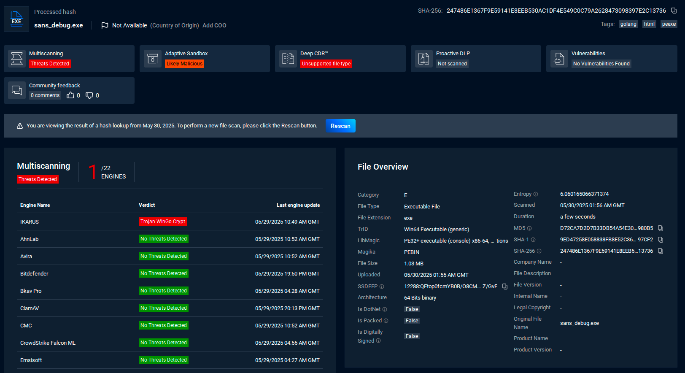 [The MetaDefender Cloud scan without debug symbols](https://metadefender.com/results/hash/247486E1367F9E59141E8EEB530AC1DF4E549C0C79A2628473098397E2C13736) now shows just 1/22 instead of 2/22 flags. |

MetaDefender Cloud also no longer complains about suspicious entropy.

> [!IMPORTANT]
> **Addendum: 06/11/2025**
>
> I revisited the scan on VirusTotal and the scan-result seems to have changed?
> There are now **8/72** malicious-flags.
>
> :::fold[Screenshot from 06/11/2025]
> 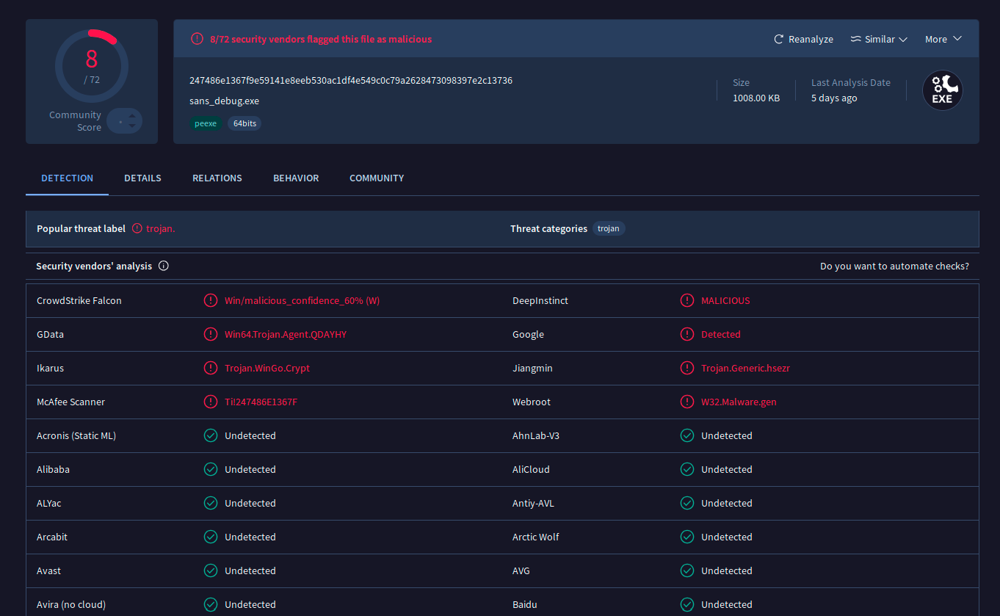
>
> We can see in the screenshot that now CrowdStrike Falcon and GData flag our executable as malicious too. I find it worrying that these test-results are seemingly not persistent. In the future I will have to take care to archive any scan-results.
> The point however still stands. Removing debug symbols decreases malicious flag.
> The MetaDefender Cloud scan stays unchanged.
> :::

### What about linux

Alright, so the problem is compressed debug symbols, but...

*Why are these only flagged for the Windows executable and not the Linux executable?*

One possible explanation is that our sections do not start with a valid ZLIB compression. Since our ZLIB compressed block and its headers are preceded by 12 bytes of data, the scanners probably don't know what to do with these sections and can't decompress them.

Another possible explanation is that the scanners are unable to decompress ZLIB at all.
The linux executables do not use ZLIB for the debug symbols but deflate. Maybe the scanners can decompress deflate but not ZLIB.

## Crypto Primitives

The next warning is the appearance of crypto algorithms in our executable.
VirusTotal explicitly lists the following:

- RC4 (PRGA)
- Base64
- Salsa20 or ChaCha
- XOR
- AES via x86 extensions

Since every Go binary contains the entire Go runtime a first assumption is that these were included as part of the Go Runtime.

### What is the Go runtime

The Go Runtime is the core of a Go program.
It contains Go's systems like garbage collection, concurrency, etc.

Go links its runtime and all other depedencies statically into each Go executable.
This allows Go executables to be self-contained, meaning they don't need any extra libraries to run. It just uses the given OS's functions. This also means that each Go executable contains the Go runtime pretty much in its entirety.

> [!TIP]
>
>We can actually inspect our executable using `ldd` to check if it links anything dynamically
>
>```console
>$ ldd main.elf
>        not a dynamic executable
>```
>
>Compare that to `cat` from the GNU coreutils:
>
>```console
>$ ldd /usr/bin/cat
>        linux-vdso.so.1 (0x000070f9eda7f000)
>        libc.so.6 => /usr/lib/libc.so.6 (0x000070f9ed829000)
>        /lib64/ld-linux-x86-64.so.2 => /usr/lib64/ld-linux-x86-64.so.2 (0x000070f9eda81000)
>```

### What the Go runtime contains

Now let us have a look at what is inside the Go runtime.
Since Go is open source we can simply have a look into [Google&#39;s Go Repository](https://cs.opensource.google/go/go/+/refs/tags/go1.24.3:src/runtime/).
The runtime is inside the `src/runtime` subdirectory:

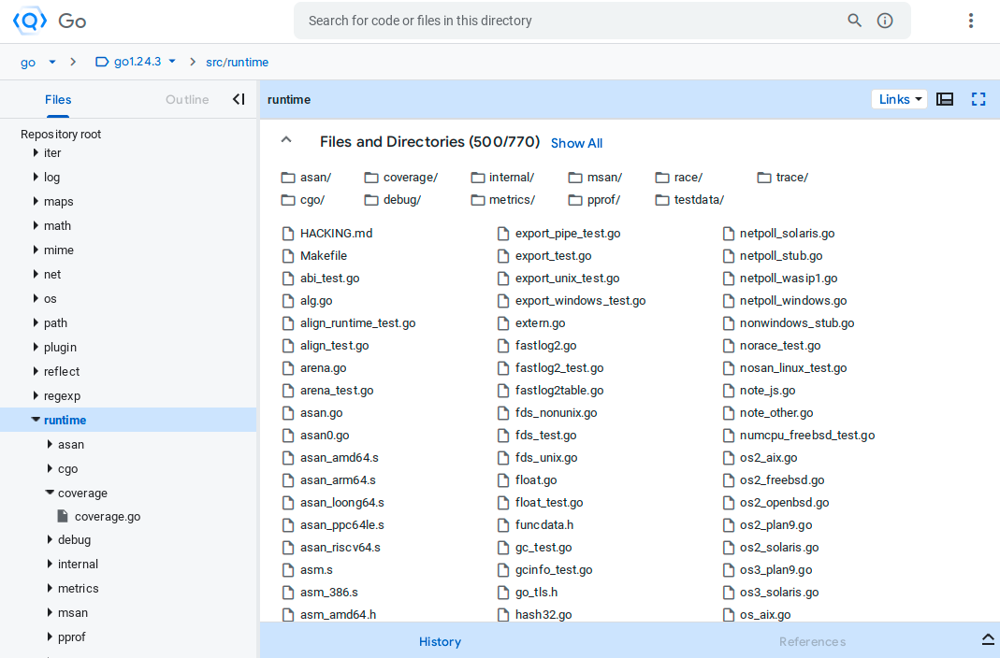

Lets now clone the repository and have search for some of our crypto primitives:

#### RC4

RC4 appears as part of the runtime in the [`os_darwin.go` file](https://cs.opensource.google/go/go/+/refs/tags/go1.24.3:src/runtime/os_darwin.go;l=195-199;drc=db956262ac4125693cffb517ea7aebf6ab04ec35):

```go showLineNumbers startLineNumber=195
//go:nosplit
func readRandom(r []byte) int {
    arc4random_buf(unsafe.Pointer(&r[0]), int32(len(r)))
    return len(r)
}
```

The name "darwin" suggests this is part of the runtimes Darwin/macOS specific code.
If we have a look at the [Mac OS 15.6 Manual Page entry for `arc4random_buf`](https://manp.gs/mac/3/arc4random_buf)[^3] it tells us that the `arc4random` and related functions are the preferred way of generating random numbers. Meaning RC4, or rather a function that once used RC4, is being used as a pseudo-random number generator in the runtime.

> [!NOTE]
>
> If you have paid close attention to the Man Page you might have noticed that `arc4random_buf` is part of the stdlib. But Go doesn't link libc during  the build process, so how can Go still acess that? Go resolves these symbols at runtime and makes direct calls so that it can make use of libc.
> This might sometimes be necessary, especially for Darwin/macOS which doesn't provide a stable syscall ABI and therefore advises the use of libc.
>
> :::fold[Underlying calls]
>
>In [`sys_darwin.go`](https://cs.opensource.google/go/go/+/refs/tags/go1.24.3:src/runtime/sys_darwin.go;l=574-581;>drc=311372c53c21740c3427f08470ed1acd1c89f81b):
>
>```go showLineNumbers startLineNumber=574
>//go:nosplit
>//go:cgo_unsafe_args
>func arc4random_buf(p unsafe.Pointer, n int32) {
>    // arc4random_buf() never fails, per its man page, so it's safe to ignore the return value.
>    libcCall(unsafe.Pointer(abi.FuncPCABI0(arc4random_buf_trampoline)), unsafe.Pointer(&p))
>    KeepAlive(p)
>}
>func arc4random_buf_trampoline()
>```
>
>In [`sys_darwin_amd64.s`](https://cs.opensource.google/go/go/+/refs/tags/go1.24.3:src/runtime/sys_darwin_amd64.s;l=503-507;>drc=43130aff52cdea05559feb9aa236efc8bbeb2677):
>
>```txt showLineNumbers startLineNumber=503
>TEXT runtime·arc4random_buf_trampoline(SB),NOSPLIT,$0
>    MOVL    8(DI), SI    // arg 2 nbytes
>    MOVQ    0(DI), DI    // arg 1 buf
>    CALL    libc_arc4random_buf(SB)
>    RET
>```
>
>:::

#### ChaCha

ChaCha appears as part of the runtime in the [`rand.go` file](https://cs.opensource.google/go/go/+/refs/tags/go1.24.3:src/runtime/rand.go;l=153-180;drc=a947912d8ad5398a78f14ceaa80369f60a3f85f8):

```go showLineNumbers startLineNumber=153
// rand returns a random uint64 from the per-m chacha8 state.
// This is called from compiler-generated code.
//
// Do not change signature: used via linkname from other packages.
//
//go:nosplit
//go:linkname rand
func rand() uint64 {
    // Note: We avoid acquirem here so that in the fast path
    // there is just a getg, an inlined c.Next, and a return.
    // The performance difference on a 16-core AMD is
    // 3.7ns/call this way versus 4.3ns/call with acquirem (+16%).
    mp := getg().m
    c := &mp.chacha8
    for {
        // Note: c.Next is marked nosplit,
        // so we don't need to use mp.locks
        // on the fast path, which is that the
        // first attempt succeeds.
        x, ok := c.Next()
        if ok {
            return x
        }
        mp.locks++ // hold m even though c.Refill may do stack split checks
        c.Refill()
        mp.locks--
    }
}
```

In this case the ChaCha algorithm is used as an internal rng for each of our machine threads ("per-m chacha8 state").

#### AES via x86 extensions

AES via x86 extensions appears as part of the runtime in the [`asm_amd64.s` file](https://cs.opensource.google/go/go/+/refs/tags/go1.24.3:src/runtime/asm_amd64.s;l=1229-1251;drc=7f9edb42259114020c67eb51643e43cf5a2cf9a7):

```go showLineNumbers startLineNumber=1229 {12}
// AX: data
// BX: hash seed
// CX: length
// At return: AX = return value
TEXT aeshashbody<>(SB),NOSPLIT,$0-0
    // Fill an SSE register with our seeds.
    MOVQ    BX, X0                // 64 bits of per-table hash seed
    PINSRW    $4, CX, X0            // 16 bits of length
    PSHUFHW $0, X0, X0            // repeat length 4 times total
    MOVO    X0, X1                // save unscrambled seed
    PXOR    runtime·aeskeysched(SB), X0    // xor in per-process seed
    AESENC    X0, X0                // scramble seed

    CMPQ    CX, $16
    JB    aes0to15
    JE    aes16
    CMPQ    CX, $32
    JBE    aes17to32
    CMPQ    CX, $64
    JBE    aes33to64
    CMPQ    CX, $128
    JBE    aes65to128
    JMP    aes129plus
```

In this case the `AESENC` instruction is used in the `aeshashbody` function to scramble a hash seed.

### What our executable contains

Now that we know that the Go runtime contains all these crypto-primitives for legitimate reasons we will have a look at what our executable contains.

#### **The Go runtime**

First of all let us confirm that our executable does actually contain the go runtime.
This is fairly easy because of the debug symbols.
We again open our executable in Ghidra und choose the *DWARF* Tab in the *Program Trees* view on the left side. We then see our files and their functions in the Program Tree. By clicking on any function Ghidra will jump to the corresponding address.

This screenshot shows the `aeshashbody` function from the `asm_amd64.s` file:

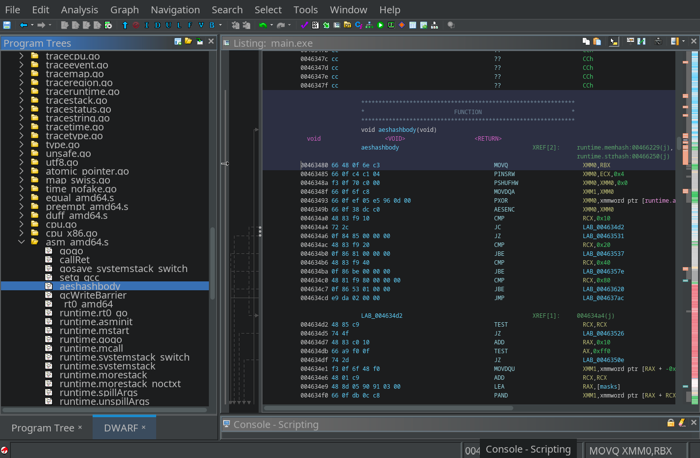

Okay, but were viewing actual actual instructions, not just debug information, right? Yes. The address of the `aeshashbody` function which Ghidra jumped to is `0x00463480`. Looking at the *Memory Map* again we can see that this is inside the TEXT section meaning executable instructions. The debug symbols just add proper names and information to these instructions.

If we want we can even view our executable without debug symbols side by side. We just have to open the *Diff* View, choose our `sans_debug.exe` and select "only Bytes" as diff-target. Then we can jump back to our address using <kbd>G</kbd>.

And we see that our executables match. It's just that we're missing debug info in the `sans_debug.exe`.

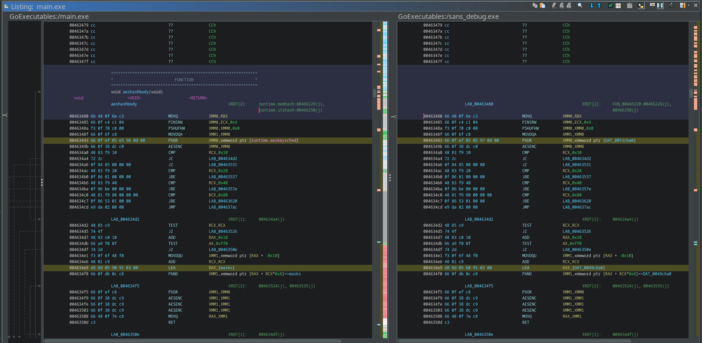

#### **VirusTotal Flags**

We now know that the Go runtime exists in our executable. Next we want to know what VirusTotal is actually flagging. Maybe there are crypto-primitives aside from the runtime in our executable?

Sadly VirusTotal doesn't tell us where exactly the "sandboxes" have found the flagged algorithms. What VirusTotal *does* tell us though is *which* sandboxes have found the algorithms.

|                                                           |                                                                           |
| --------------------------------------------------------- | ------------------------------------------------------------------------- |
| 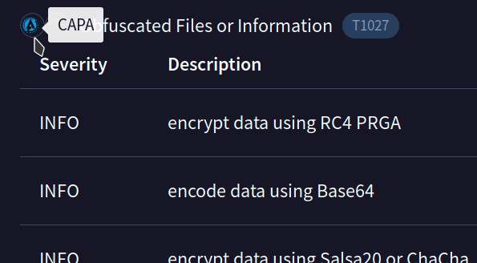 The capa logo under defense evasion | 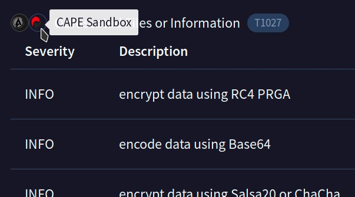 The CAPE Sandbox logo under defense evasion |

Again, sadly the [CAPE Sandbox Report on VirusTotal](https://www.virustotal.com/ui/file_behaviours/95ad16faede5a5c6d257daeb2220801614704576188a8c9abd0767e0455dafe2_CAPE%20Sandbox/html) doesn't tell us where these algorithms were detected. It doesn't even include defense evasion in the first place.
The capa report also isn't included in VirusTotal.

Luckily we can run capa and CAPE ourselves.
Both [capa](https://github.com/mandiant/capa/) and [CAPE](https://github.com/kevoreilly/CAPEv2) are open source and available on GitHub. Since capa is using static analysis[^2] and is easy to set up (no virtualization required) we will see if it provides us with more information first. So we download the capa binary from GitHub and start analysing:

```console
$ ./capa --version
capa 9.1.0

$ ./capa ~/main.exe
┌─────────────┬────────────────────────────────────────────────────────────────────────────────────┐
│ md5         │ c704342a8077ade485d7699913b69680                                                   │
│ sha1        │ 1d199b86fe32730c2830b26286c54bcb07590a4e                                           │
│ sha256      │ 95ad16faede5a5c6d257daeb2220801614704576188a8c9abd0767e0455dafe2                   │
│ analysis    │ static                                                                             │
│ os          │ windows                                                                            │
│ format      │ pe                                                                                 │
│ arch        │ amd64                                                                              │
│ path        │ /home/samuel/main.exe                                                              │
└─────────────┴────────────────────────────────────────────────────────────────────────────────────┘
┏━━━━━━━━━━━━━━━━━━━━━━━━━━━┳━━━━━━━━━━━━━━━━━━━━━━━━━━━━━━━━━━━━━━━━━━━━━━━━━━━━━━━━━━━━━━━━━━━━━━┓
┃ ATT&CK Tactic             ┃ ATT&CK Technique                                                     ┃
┡━━━━━━━━━━━━━━━━━━━━━━━━━━━╇━━━━━━━━━━━━━━━━━━━━━━━━━━━━━━━━━━━━━━━━━━━━━━━━━━━━━━━━━━━━━━━━━━━━━━┩
│ DEFENSE EVASION           │ Obfuscated Files or Information [T1027]                              │
│                           │ Virtualization/Sandbox Evasion::System Checks [T1497.001]            │
│ EXECUTION                 │ Shared Modules [T1129]                                               │
└───────────────────────────┴──────────────────────────────────────────────────────────────────────┘
┏━━━━━━━━━━━━━━━━━━━━━━━━━━┳━━━━━━━━━━━━━━━━━━━━━━━━━━━━━━━━━━━━━━━━━━━━━━━━━━━━━━━━━━━━━━━━━━━━━━━━━━━━┓
┃ MBC Objective            ┃ MBC Behavior                                                               ┃
┡━━━━━━━━━━━━━━━━━━━━━━━━━━╇━━━━━━━━━━━━━━━━━━━━━━━━━━━━━━━━━━━━━━━━━━━━━━━━━━━━━━━━━━━━━━━━━━━━━━━━━━━━┩
│ ANTI-BEHAVIORAL ANALYSIS │ Virtual Machine Detection [B0009]                                          │
│ CRYPTOGRAPHY             │ Encrypt Data::AES [C0027.001]                                              │
│                          │ Encrypt Data::RC4 [C0027.009]                                              │
│                          │ Generate Pseudo-random Sequence::RC4 PRGA [C0021.004]                      │
│ DATA                     │ Encode Data::Base64 [C0026.001]                                            │
│                          │ Encode Data::XOR [C0026.002]                                               │
│                          │ Non-Cryptographic Hash::MurmurHash [C0030.001]                             │
│ DEFENSE EVASION          │ Obfuscated Files or Information::Encoding-Standard Algorithm [E1027.m02]   │
│                          │ Obfuscated Files or Information::Encryption-Standard Algorithm [E1027.m05] │
│ PROCESS                  │ Allocate Thread Local Storage [C0040]                                      │
└──────────────────────────┴────────────────────────────────────────────────────────────────────────────┘
┏━━━━━━━━━━━━━━━━━━━━━━━━━━━━━━━━━━━━━━━━━━━━━━━━━━━━━━━━━━┳━━━━━━━━━━━━━━━━━━━━━━━━━━━━━━━━━━━━━━━┓
┃ Capability                                               ┃ Namespace                             ┃
┡━━━━━━━━━━━━━━━━━━━━━━━━━━━━━━━━━━━━━━━━━━━━━━━━━━━━━━━━━━╇━━━━━━━━━━━━━━━━━━━━━━━━━━━━━━━━━━━━━━━┩
│ reference anti-VM strings                                │ anti-analysis/anti-vm/vm-detection    │
│ compiled with Go                                         │ compiler/go                           │
│ encode data using Base64                                 │ data-manipulation/encoding/base64     │
│ encode data using XOR                                    │ data-manipulation/encoding/xor        │
│ encrypt data using AES via x86 extensions (3 matches)    │ data-manipulation/encryption/aes      │
│ encrypt data using RC4 PRGA                              │ data-manipulation/encryption/rc4      │
│ encrypt data using Salsa20 or ChaCha                     │ data-manipulation/encryption/salsa20  │
│ hash data using murmur3 (5 matches)                      │ data-manipulation/hashing/murmur      │
│ allocate thread local storage                            │ host-interaction/thread/tls           │
│ get kernel32 base address (5 matches)                    │ linking/runtime-linking               │
│ resolve function by parsing PE exports                   │ load-code/pe                          │
└──────────────────────────────────────────────────────────┴───────────────────────────────────────┘
```

It took capa 40 seconds to match our executable against 1354 of its integrated rules.
A quick look into the "Capability" table confirms that capa found our algorithms.
To now get more details about where capa found them we simply run capa again, this time with the very verbose flag (`-vv`).

If you care about the full output of the command you can open this detail section (it's a lot). If not you can continue reading. In the next sections we will go over each found capability and the relevant output of the command.

:::fold[Full output]

```console
./capa -vv ~/main.exe
md5                     c704342a8077ade485d7699913b69680
sha1                    1d199b86fe32730c2830b26286c54bcb07590a4e
sha256                  95ad16faede5a5c6d257daeb2220801614704576188a8c9abd0767e0455dafe2
path                    /home/samuel/main.exe
timestamp               2025-06-12 15:15:06.950269
capa version            9.1.0
os                      windows
format                  pe
arch                    amd64
analysis                static
extractor               VivisectFeatureExtractor
base address            0x400000
rules                   /tmp/_MEI7ShEqS/rules
function count          1350
library function count  4
total feature count     99707

PEB access (34 matches, only showing first match of library rule)
author      michael.hunhoff@mandiant.com
scope       basic block
mbc         Anti-Behavioral Analysis::Debugger Detection::Process Environment Block [B0001.019]
references  https://github.com/LordNoteworthy/al-khaser/blob/master/al-khaser/AntiDebug/NtGlobalFlag.cpp
basic block @ 0x40DA59 in function 0x40D8C0
  or:
    and:
      arch: amd64
      characteristic: gs access @ 0x40DA75
      or:
        offset: 0x60 @ 0x40DA7C

contain loop (651 matches, only showing first match of library rule)
author  moritz.raabe@mandiant.com
scope   function
function @ 0x4010E0
  or:
    characteristic: loop @ 0x4010E0

get OS version (library rule)
author  @mr-tz
scope   function
function @ 0x4628E0
  or:
    and:
      match: PEB access @ 0x462E7A
        or:
          and:
            arch: amd64
            characteristic: gs access @ 0x462F26
            or:
              offset: 0x60 @ 0x462F08
      or:
        and:
          arch: amd64
          or:
            offset: 0x118 = PEB->OSMajorVersion @ 0x462953, 0x462978, 0x462C3B, 0x462C47
            offset: 0x120 = PEB->OSBuildNumber @ 0x462960

reference anti-VM strings
namespace   anti-analysis/anti-vm/vm-detection
author      moritz.raabe@mandiant.com
scope       file
att&ck      Defense Evasion::Virtualization/Sandbox Evasion::System Checks [T1497.001]
mbc         Anti-Behavioral Analysis::Virtual Machine Detection [B0009]
references  https://github.com/ctxis/CAPE/blob/master/modules/signatures/antivm_*, https://github.com/LordNoteworthy/al-khaser/blob/master/al-khaser/AntiVM/Generic.cpp
or:
  regex: /test.exe/i
    - "\tm= sp= sp: lr: fp= gp= mp=) m=boolint8uintchanfuncermsfsrmsse3avx2bmi1bmi2defersweeptestRtestWexecWhchanexecRschedsudogtimergscanmheaptracepanicsleep cnt=gcing MB,
got= ..." @ file+0x7DF8B

compiled with Go
namespace  compiler/go
author     michael.hunhoff@mandiant.com
scope      file
or:
  regex: /\bgo1\.\d/
    - "go1.24.3" @ file+0x9B290, file+0xF2E21
  substring: runtime.main
    - "pacer: assist ratio=workbuf is not emptybad use of bucket.mpbad use of bucket.bppreempt off reason: forcegc: phase errorgopark: bad g statusgo of nil func valuesemaRoot
rotateRightreflect.makeFuncStubtrace: out of memorywirep: already in gonegative shift amountdataindependenttimingsystem goroutine waitruntime: work.nwait=  previous
allocCount=, levelBits = runtime: searchIdx = panic on system stackasync stack too largestartm: m is spinningstartlockedm: m has pfindrunnable: wrong ppreempt at unknown
pcreleasep: invalid argcheckdead: runnable gruntime: newstack at runtime: newstack sp=runtime: confused by  pcHeader.textStart= timer data corruptionconcurrent map
writesinteger divide by zeroCountPagesInUse (test)ReadMetricsSlow (test)trace reader (blocked)trace goroutine statusGC weak to strong waitsend on closed channelcall not
at safe pointgetenv before env initinterface conversion: freeIndex is not valids.freeindex > s.nelemsbad sweepgen in refillspan has no free spaceruntime: work.nwait =
runtime:scanstack: gp=scanstack - bad statusheadTailIndex overflowruntime.main not on m0set_crosscall2 missingbad g->status in readywirep: invalid p stateassembly checks
failedstack not a power of 2minpc or maxpc invalidcompileCallback: type non-Go function at pc=exit hook invoked exitindex out of range [%x]ReadMemStatsSlow
(test)runtimecontentionstackschan receive (nil chan)garbage collection scanchan receive (synctest)makechan: bad alignmentclose of closed channelunlock of unlocked lock)
must be a power of 2" @ file+0x7FC42
    - "runtime.main" @ file+0xA4131, file+0x17A687
    - "runtime.main.func1" @ file+0xA7EDE, file+0x17D020
    - "runtime.main.func2" @ file+0xA4162, file+0x17A694
    - "runtime.mainPC" @ file+0x1800C0
    - "runtime.mainStarted" @ file+0x17F3EF
    - "runtime.main_init_done" @ file+0x17F3D8
  substring: main.main
    - "main.main" @ file+0xA9661, file+0x17E874
  substring: runtime.gcWork
    - "*runtime.gcWork" @ file+0x6D741
    - "type:.eq.runtime.gcWork" @ file+0xA94E7, file+0x17E6FA

encode data using Base64
namespace  data-manipulation/encoding/base64
author     moritz.raabe@mandiant.com, anushka.virgaonkar@mandiant.com, michael.hunhoff@mandiant.com
scope      function
att&ck     Defense Evasion::Obfuscated Files or Information [T1027]
mbc        Defense Evasion::Obfuscated Files or Information::Encoding-Standard Algorithm [E1027.m02], Data::Encode Data::Base64 [C0026.001]
function @ 0x443540
  or:
    and:
      mnemonic: shl @ 0x4435E8, 0x44363B
      mnemonic: shr @ 0x4435C5, 0x443618, 0x44368C
      number: 0x3F = modulo 64 @ 0x4436A1
      or:
        number: 0x3D = '=' @ 0x44368C
      match: contain loop @ 0x443540
        or:
          characteristic: loop @ 0x443540
          characteristic: tight loop @ 0x443552

encode data using XOR
namespace  data-manipulation/encoding/xor
author     moritz.raabe@mandiant.com
scope      basic block
att&ck     Defense Evasion::Obfuscated Files or Information [T1027]
mbc        Defense Evasion::Obfuscated Files or Information::Encoding-Standard Algorithm [E1027.m02], Data::Encode Data::XOR [C0026.002]
basic block @ 0x40622D in function 0x406140
  and:
    characteristic: tight loop @ 0x40622D
    characteristic: nzxor @ 0x406231, 0x406247, 0x406251, 0x406266, and 60 more...
    not: = filter for potential false positives
      or:
        or: = unsigned bitwise negation operation (~i)
          number: 0xFFFFFFFF = bitwise negation for unsigned 32 bits
          number: 0xFFFFFFFFFFFFFFFF = bitwise negation for unsigned 64 bits
        or: = signed bitwise negation operation (~i)
          number: 0xFFFFFFF = bitwise negation for signed 32 bits
          number: 0xFFFFFFFFFFFFFFF = bitwise negation for signed 64 bits
        or: = Magic constants used in the implementation of strings functions.
          number: 0x7EFEFEFF = optimized string constant for 32 bits
          number: 0x81010101 = -0x81010101 = 0x7EFEFEFF
          number: 0x81010100 = 0x81010100 = ~0x7EFEFEFF
          number: 0x7EFEFEFEFEFEFEFF = optimized string constant for 64 bits
          number: 0x8101010101010101 = -0x8101010101010101 = 0x7EFEFEFEFEFEFEFF
          number: 0x8101010101010100 = 0x8101010101010100 = ~0x7EFEFEFEFEFEFEFF

encrypt data using AES via x86 extensions (3 matches)
namespace  data-manipulation/encryption/aes
author     moritz.raabe@mandiant.com
scope      function
att&ck     Defense Evasion::Obfuscated Files or Information [T1027]
mbc        Defense Evasion::Obfuscated Files or Information::Encryption-Standard Algorithm [E1027.m05], Cryptography::Encrypt Data::AES [C0027.001]
function @ 0x466220
  or:
    mnemonic: aesenc = Perform One Round of an AES Encryption Flow @ 0x46349B, 0x4634F9, 0x4634FE, 0x463503, and 101 more...
function @ 0x466240
  or:
    mnemonic: aesenc = Perform One Round of an AES Encryption Flow @ 0x46349B, 0x4634F9, 0x4634FE, 0x463503, and 101 more...
function @ 0x466260
  or:
    mnemonic: aesenc = Perform One Round of an AES Encryption Flow @ 0x466274, 0x46627D, 0x466286

encrypt data using RC4 PRGA
namespace  data-manipulation/encryption/rc4
author     moritz.raabe@mandiant.com
scope      function
att&ck     Defense Evasion::Obfuscated Files or Information [T1027]
mbc        Cryptography::Encrypt Data::RC4 [C0027.009], Cryptography::Generate Pseudo-random Sequence::RC4 PRGA [C0021.004]
function @ 0x44E140
  and:
    match: contain loop @ 0x44E140
      or:
        characteristic: loop @ 0x44E140
    count(characteristic(nzxor)): 1 @ 0x44E198
    count(characteristic(calls from)): 4 or fewer @ 0x4666C0, 0x466780
    count(basic block): between 4 and 50 @ 0x44E140, 0x44E156, 0x44E15D, 0x44E165, and 24 more...
    or:
      count(mnemonic(movzx)): 4 or more @ 0x44E156, 0x44E1C9, 0x44E225, 0x44E27C

encrypt data using Salsa20 or ChaCha
namespace   data-manipulation/encryption/salsa20
author      moritz.raabe@mandiant.com
scope       function
att&ck      Defense Evasion::Obfuscated Files or Information [T1027]
references  http://cr.yp.to/snuffle/ecrypt.c
function @ 0x406140
  or: = part of key setup
    and:
      number: 0x61707865 = "apxe" @ 0x406148
      number: 0x3320646E = "3 dn" @ 0x406157
      number: 0x79622D32 = "yb-2" @ 0x406166
      number: 0x6B206574 = "k et" @ 0x406175

hash data using murmur3 (5 matches)
namespace   data-manipulation/hashing/murmur
author      william.ballenthin@mandiant.com
scope       function
mbc         Data::Non-Cryptographic Hash::MurmurHash [C0030.001]
references  https://github.com/aappleby/smhasher/blob/master/src/MurmurHash3.cpp
function @ 0x41BF00
  or:
    basic block:
      and: = hash >> 16; hash >> 13; hash >> 16
        instruction:
          and:
            mnemonic: shr @ 0x41BFEB
            number: 0x10 @ 0x41BFEB
        instruction:
          and:
            mnemonic: shr @ 0x41BFFC
            number: 0xD @ 0x41BFFC
        count(mnemonic(shr)): 3 @ 0x41BFD7, 0x41BFEB, 0x41BFFC
function @ 0x41C640
  or:
    basic block:
      and: = hash >> 16; hash >> 13; hash >> 16
        instruction:
          and:
            mnemonic: shr @ 0x41C6DE
            number: 0x10 @ 0x41C6DE
        instruction:
          and:
            mnemonic: shr @ 0x41C6ED
            number: 0xD @ 0x41C6ED
        count(mnemonic(shr)): 3 @ 0x41C6CB, 0x41C6DE, 0x41C6ED
function @ 0x424BA0
  or:
    basic block:
      and: = hash >> 16; hash >> 13; hash >> 16
        instruction:
          and:
            mnemonic: shr @ 0x424DCA
            number: 0x10 @ 0x424DCA
        instruction:
          and:
            mnemonic: shr @ 0x424DDC
            number: 0xD @ 0x424DDC
        count(mnemonic(shr)): 3 @ 0x424DB8, 0x424DCA, 0x424DDC
function @ 0x425280
  or:
    basic block:
      and: = hash >> 16; hash >> 13; hash >> 16
        instruction:
          and:
            mnemonic: shr @ 0x42532F
            number: 0x10 @ 0x42532F
        instruction:
          and:
            mnemonic: shr @ 0x425341
            number: 0xD @ 0x425341
        count(mnemonic(shr)): 3 @ 0x42531C, 0x42532F, 0x425341
function @ 0x42DA60
  or:
    basic block:
      and: = hash >> 16; hash >> 13; hash >> 16
        instruction:
          and:
            mnemonic: shr @ 0x42DBDA
            number: 0x10 @ 0x42DBDA
        instruction:
          and:
            mnemonic: shr @ 0x42DBEB
            number: 0xD @ 0x42DBEB
        count(mnemonic(shr)): 3 @ 0x42DBC5, 0x42DBDA, 0x42DBEB

allocate thread local storage
namespace  host-interaction/thread/tls
author     michael.hunhoff@mandiant.com
scope      function
mbc        Process::Allocate Thread Local Storage [C0040]
function @ 0x468040
  or:
    api: TlsAlloc @ 0x46805B

access PEB ldr_data (18 matches)
namespace   linking/runtime-linking
author      moritz.raabe@mandiant.com
scope       basic block
att&ck      Execution::Shared Modules [T1129]
references  https://www.geoffchappell.com/studies/windows/km/ntoskrnl/inc/api/ntpsapi_x/peb_ldr_data.htm,
            https://github.com/d35ha/CallObfuscator/blob/5834aff9ff4511f1408ae4ce80b79737af4ae77b/ShellCode/shell_x64.asm#L8
basic block @ 0x40DA59 in function 0x40D8C0
  or:
    and: = x64
      arch: amd64
      match: PEB access @ 0x40DA59
        or:
          and:
            arch: amd64
            characteristic: gs access @ 0x40DA75
            or:
              offset: 0x60 @ 0x40DA7C
      offset: 0x18 = PEB.LDR_DATA @ 0x40DA8C
      or: = resolve a module list
        offset: 0x20 = PEB.LDR_DATA.InMemoryOrderModuleList @ 0x40DA91
basic block @ 0x40DAA9 in function 0x40D8C0
  or:
    and: = x64
      arch: amd64
      match: PEB access @ 0x40DAA9
        or:
          and:
            arch: amd64
            characteristic: gs access @ 0x40DAC0
            or:
              offset: 0x60 @ 0x40DAC7
      offset: 0x18 = PEB.LDR_DATA @ 0x40DAD7
      or: = resolve a module list
        offset: 0x20 = PEB.LDR_DATA.InMemoryOrderModuleList @ 0x40DADC
basic block @ 0x4137AA in function 0x4137A0
  or:
    and: = x64
      arch: amd64
      match: PEB access @ 0x4137AA
        or:
          and:
            arch: amd64
            characteristic: gs access @ 0x4137EA
            or:
              offset: 0x60 @ 0x4137B7
      offset: 0x18 = PEB.LDR_DATA @ 0x4137D1
      or: = resolve a module list
        offset: 0x10 = PEB.LDR_DATA.InLoadOrderModuleList @ 0x4137CC
        offset: 0x20 = PEB.LDR_DATA.InMemoryOrderModuleList @ 0x4137F1
basic block @ 0x41396A in function 0x413960
  or:
    and: = x64
      arch: amd64
      match: PEB access @ 0x41396A
        or:
          and:
            arch: amd64
            characteristic: gs access @ 0x4139B3
            or:
              offset: 0x60 @ 0x413972, 0x4139BA
      offset: 0x18 = PEB.LDR_DATA @ 0x413991
      or: = resolve a module list
        offset: 0x10 = PEB.LDR_DATA.InLoadOrderModuleList @ 0x41398C
        offset: 0x20 = PEB.LDR_DATA.InMemoryOrderModuleList @ 0x41399A
basic block @ 0x41EC25 in function 0x41EBC0
  or:
    and: = x64
      arch: amd64
      match: PEB access @ 0x41EC25
        or:
          and:
            arch: amd64
            characteristic: gs access @ 0x41EC72
            or:
              offset: 0x60 @ 0x41EC4F
      offset: 0x18 = PEB.LDR_DATA @ 0x41EC2C, 0x41EC59
      or: = resolve a module list
        offset: 0x10 = PEB.LDR_DATA.InLoadOrderModuleList @ 0x41EC31
        offset: 0x20 = PEB.LDR_DATA.InMemoryOrderModuleList @ 0x41EC36
        offset: 0x30 = PEB.LDR_DATA.InInitializationOrderModuleList @ 0x41EC45
basic block @ 0x42BD4B in function 0x42BCC0
  or:
    and: = x64
      arch: amd64
      match: PEB access @ 0x42BD4B
        or:
          and:
            arch: amd64
            characteristic: gs access @ 0x42BDB2
            or:
              offset: 0x60 @ 0x42BD4B, 0x42BD59, 0x42BDBE
      offset: 0x18 = PEB.LDR_DATA @ 0x42BD65, 0x42BD99
      or: = resolve a module list
        offset: 0x10 = PEB.LDR_DATA.InLoadOrderModuleList @ 0x42BD50, 0x42BD81, 0x42BDB9, 0x42BDC3
        offset: 0x20 = PEB.LDR_DATA.InMemoryOrderModuleList @ 0x42BD6F
        offset: 0x30 = PEB.LDR_DATA.InInitializationOrderModuleList @ 0x42BD7C
basic block @ 0x430273 in function 0x430060
  or:
    and: = x64
      arch: amd64
      match: PEB access @ 0x430273
        or:
          and:
            arch: amd64
            characteristic: gs access @ 0x4302CA
            or:
              offset: 0x60 @ 0x43028B
      offset: 0x18 = PEB.LDR_DATA @ 0x4302B1
      or: = resolve a module list
        offset: 0x10 = PEB.LDR_DATA.InLoadOrderModuleList @ 0x4302AC
        offset: 0x20 = PEB.LDR_DATA.InMemoryOrderModuleList @ 0x4302D1
basic block @ 0x430C60 in function 0x430C60
  or:
    and: = x64
      arch: amd64
      match: PEB access @ 0x430C60
        or:
          and:
            arch: amd64
            characteristic: gs access @ 0x430C78, 0x430CAA
            or:
              offset: 0x60 @ 0x430C68, 0x430CB6
      offset: 0x18 = PEB.LDR_DATA @ 0x430C9A
      or: = resolve a module list
        offset: 0x20 = PEB.LDR_DATA.InMemoryOrderModuleList @ 0x430C8E
        offset: 0x30 = PEB.LDR_DATA.InInitializationOrderModuleList @ 0x430C7F
basic block @ 0x440AF2 in function 0x440940
  or:
    and: = x64
      arch: amd64
      match: PEB access @ 0x440AF2
        or:
          and:
            arch: amd64
            characteristic: gs access @ 0x440B20, 0x440B5A
            or:
              offset: 0x60 @ 0x440AF2
      offset: 0x18 = PEB.LDR_DATA @ 0x440B3C
      or: = resolve a module list
        offset: 0x10 = PEB.LDR_DATA.InLoadOrderModuleList @ 0x440B37, 0x440B41
        offset: 0x20 = PEB.LDR_DATA.InMemoryOrderModuleList @ 0x440AFD, 0x440B07
basic block @ 0x447B69 in function 0x447AC0
  or:
    and: = x64
      arch: amd64
      match: PEB access @ 0x447B69
        or:
          and:
            arch: amd64
            characteristic: gs access @ 0x447BD1
            or:
              offset: 0x60 @ 0x447B75
      offset: 0x18 = PEB.LDR_DATA @ 0x447B9B
      or: = resolve a module list
        offset: 0x10 = PEB.LDR_DATA.InLoadOrderModuleList @ 0x447B96
        offset: 0x20 = PEB.LDR_DATA.InMemoryOrderModuleList @ 0x447BA0
        offset: 0x30 = PEB.LDR_DATA.InInitializationOrderModuleList @ 0x447BAA
basic block @ 0x45ACBD in function 0x45AC80
  or:
    and: = x64
      arch: amd64
      match: PEB access @ 0x45ACBD
        or:
          and:
            arch: amd64
            characteristic: gs access @ 0x45AD0A
            or:
              offset: 0x60 @ 0x45ACD8
      offset: 0x18 = PEB.LDR_DATA @ 0x45ACBD, 0x45AD11
      or: = resolve a module list
        offset: 0x20 = PEB.LDR_DATA.InMemoryOrderModuleList @ 0x45ACC9, 0x45ACF1
        offset: 0x30 = PEB.LDR_DATA.InInitializationOrderModuleList @ 0x45ACDD
basic block @ 0x4606E6 in function 0x460640
  or:
    and: = x64
      arch: amd64
      match: PEB access @ 0x4606E6
        or:
          and:
            arch: amd64
            characteristic: gs access @ 0x460728
            or:
              offset: 0x60 @ 0x460700
      offset: 0x18 = PEB.LDR_DATA @ 0x4606F6
      or: = resolve a module list
        offset: 0x30 = PEB.LDR_DATA.InInitializationOrderModuleList @ 0x46072F
basic block @ 0x46328A in function 0x463280
  or:
    and: = x64
      arch: amd64
      match: PEB access @ 0x46328A
        or:
          and:
            arch: amd64
            characteristic: gs access @ 0x46331D
            or:
              offset: 0x60 @ 0x4632CF
      offset: 0x18 = PEB.LDR_DATA @ 0x4632AB, 0x4632D4
      or: = resolve a module list
        offset: 0x10 = PEB.LDR_DATA.InLoadOrderModuleList @ 0x4632A5, 0x4632CA, 0x463304
        offset: 0x20 = PEB.LDR_DATA.InMemoryOrderModuleList @ 0x4632D9
        offset: 0x30 = PEB.LDR_DATA.InInitializationOrderModuleList @ 0x4632EB
basic block @ 0x467920 in function 0x467BC0
  or:
    and: = x64
      arch: amd64
      match: PEB access @ 0x467920
        or:
          and:
            arch: amd64
            characteristic: gs access @ 0x4679AE
            or:
              offset: 0x60 @ 0x46795E
      offset: 0x18 = PEB.LDR_DATA @ 0x46793B
      or: = resolve a module list
        offset: 0x10 = PEB.LDR_DATA.InLoadOrderModuleList @ 0x467936
        offset: 0x20 = PEB.LDR_DATA.InMemoryOrderModuleList @ 0x467940
        offset: 0x30 = PEB.LDR_DATA.InInitializationOrderModuleList @ 0x46794A
basic block @ 0x467920 in function 0x467BC0
  or:
    and: = x64
      arch: amd64
      match: PEB access @ 0x467920
        or:
          and:
            arch: amd64
            characteristic: gs access @ 0x4679AE
            or:
              offset: 0x60 @ 0x46795E
      offset: 0x18 = PEB.LDR_DATA @ 0x46793B
      or: = resolve a module list
        offset: 0x10 = PEB.LDR_DATA.InLoadOrderModuleList @ 0x467936
        offset: 0x20 = PEB.LDR_DATA.InMemoryOrderModuleList @ 0x467940
        offset: 0x30 = PEB.LDR_DATA.InInitializationOrderModuleList @ 0x46794A
basic block @ 0x467920 in function 0x467BC0
  or:
    and: = x64
      arch: amd64
      match: PEB access @ 0x467920
        or:
          and:
            arch: amd64
            characteristic: gs access @ 0x4679AE
            or:
              offset: 0x60 @ 0x46795E
      offset: 0x18 = PEB.LDR_DATA @ 0x46793B
      or: = resolve a module list
        offset: 0x10 = PEB.LDR_DATA.InLoadOrderModuleList @ 0x467936
        offset: 0x20 = PEB.LDR_DATA.InMemoryOrderModuleList @ 0x467940
        offset: 0x30 = PEB.LDR_DATA.InInitializationOrderModuleList @ 0x46794A
basic block @ 0x467920 in function 0x467BC0
  or:
    and: = x64
      arch: amd64
      match: PEB access @ 0x467920
        or:
          and:
            arch: amd64
            characteristic: gs access @ 0x4679AE
            or:
              offset: 0x60 @ 0x46795E
      offset: 0x18 = PEB.LDR_DATA @ 0x46793B
      or: = resolve a module list
        offset: 0x10 = PEB.LDR_DATA.InLoadOrderModuleList @ 0x467936
        offset: 0x20 = PEB.LDR_DATA.InMemoryOrderModuleList @ 0x467940
        offset: 0x30 = PEB.LDR_DATA.InInitializationOrderModuleList @ 0x46794A
basic block @ 0x467BE0 in function 0x467BE0
  or:
    and: = x64
      arch: amd64
      match: PEB access @ 0x467BE0
        or:
          and:
            arch: amd64
            characteristic: gs access @ 0x467C6B
            or:
              offset: 0x60 @ 0x467C22
      offset: 0x18 = PEB.LDR_DATA @ 0x467BFF
      or: = resolve a module list
        offset: 0x10 = PEB.LDR_DATA.InLoadOrderModuleList @ 0x467BFA
        offset: 0x20 = PEB.LDR_DATA.InMemoryOrderModuleList @ 0x467C04
        offset: 0x30 = PEB.LDR_DATA.InInitializationOrderModuleList @ 0x467C0E

get kernel32 base address (5 matches)
namespace   linking/runtime-linking
author      moritz.raabe@mandiant.com
scope       basic block
att&ck      Execution::Shared Modules [T1129]
references  https://idafchev.github.io/exploit/2017/09/26/writing_windows_shellcode.html,
            https://www.geoffchappell.com/studies/windows/win32/ntdll/structs/ldr_data_table_entry.htm
basic block @ 0x467920 in function 0x467BC0
  and:
    match: access PEB ldr_data @ 0x467920
      or:
        and: = x64
          arch: amd64
          match: PEB access @ 0x467920
            or:
              and:
                arch: amd64
                characteristic: gs access @ 0x4679AE
                or:
                  offset: 0x60 @ 0x46795E
          offset: 0x18 = PEB.LDR_DATA @ 0x46793B
          or: = resolve a module list
            offset: 0x10 = PEB.LDR_DATA.InLoadOrderModuleList @ 0x467936
            offset: 0x20 = PEB.LDR_DATA.InMemoryOrderModuleList @ 0x467940
            offset: 0x30 = PEB.LDR_DATA.InInitializationOrderModuleList @ 0x46794A
    count(offset): 2 @ 0x46792D, 0x4679AE
    or:
      and:
        arch: amd64
        offset: 0x30 = LDR_DATA_TABLE_ENTRY.DllBase @ 0x46794A
basic block @ 0x467920 in function 0x467BC0
  and:
    match: access PEB ldr_data @ 0x467920
      or:
        and: = x64
          arch: amd64
          match: PEB access @ 0x467920
            or:
              and:
                arch: amd64
                characteristic: gs access @ 0x4679AE
                or:
                  offset: 0x60 @ 0x46795E
          offset: 0x18 = PEB.LDR_DATA @ 0x46793B
          or: = resolve a module list
            offset: 0x10 = PEB.LDR_DATA.InLoadOrderModuleList @ 0x467936
            offset: 0x20 = PEB.LDR_DATA.InMemoryOrderModuleList @ 0x467940
            offset: 0x30 = PEB.LDR_DATA.InInitializationOrderModuleList @ 0x46794A
    count(offset): 2 @ 0x46792D, 0x4679AE
    or:
      and:
        arch: amd64
        offset: 0x30 = LDR_DATA_TABLE_ENTRY.DllBase @ 0x46794A
basic block @ 0x467920 in function 0x467BC0
  and:
    match: access PEB ldr_data @ 0x467920
      or:
        and: = x64
          arch: amd64
          match: PEB access @ 0x467920
            or:
              and:
                arch: amd64
                characteristic: gs access @ 0x4679AE
                or:
                  offset: 0x60 @ 0x46795E
          offset: 0x18 = PEB.LDR_DATA @ 0x46793B
          or: = resolve a module list
            offset: 0x10 = PEB.LDR_DATA.InLoadOrderModuleList @ 0x467936
            offset: 0x20 = PEB.LDR_DATA.InMemoryOrderModuleList @ 0x467940
            offset: 0x30 = PEB.LDR_DATA.InInitializationOrderModuleList @ 0x46794A
    count(offset): 2 @ 0x46792D, 0x4679AE
    or:
      and:
        arch: amd64
        offset: 0x30 = LDR_DATA_TABLE_ENTRY.DllBase @ 0x46794A
basic block @ 0x467920 in function 0x467BC0
  and:
    match: access PEB ldr_data @ 0x467920
      or:
        and: = x64
          arch: amd64
          match: PEB access @ 0x467920
            or:
              and:
                arch: amd64
                characteristic: gs access @ 0x4679AE
                or:
                  offset: 0x60 @ 0x46795E
          offset: 0x18 = PEB.LDR_DATA @ 0x46793B
          or: = resolve a module list
            offset: 0x10 = PEB.LDR_DATA.InLoadOrderModuleList @ 0x467936
            offset: 0x20 = PEB.LDR_DATA.InMemoryOrderModuleList @ 0x467940
            offset: 0x30 = PEB.LDR_DATA.InInitializationOrderModuleList @ 0x46794A
    count(offset): 2 @ 0x46792D, 0x4679AE
    or:
      and:
        arch: amd64
        offset: 0x30 = LDR_DATA_TABLE_ENTRY.DllBase @ 0x46794A
basic block @ 0x467BE0 in function 0x467BE0
  and:
    match: access PEB ldr_data @ 0x467BE0
      or:
        and: = x64
          arch: amd64
          match: PEB access @ 0x467BE0
            or:
              and:
                arch: amd64
                characteristic: gs access @ 0x467C6B
                or:
                  offset: 0x60 @ 0x467C22
          offset: 0x18 = PEB.LDR_DATA @ 0x467BFF
          or: = resolve a module list
            offset: 0x10 = PEB.LDR_DATA.InLoadOrderModuleList @ 0x467BFA
            offset: 0x20 = PEB.LDR_DATA.InMemoryOrderModuleList @ 0x467C04
            offset: 0x30 = PEB.LDR_DATA.InInitializationOrderModuleList @ 0x467C0E
    count(offset): 2 @ 0x467BF1, 0x467C6B
    or:
      and:
        arch: amd64
        offset: 0x30 = LDR_DATA_TABLE_ENTRY.DllBase @ 0x467C0E

resolve function by parsing PE exports
namespace  load-code/pe
author     sara-rn
scope      function
function @ 0x454000
  and:
    os: windows
    or:
      characteristic: loop @ 0x454000
      mnemonic: movzx @ 0x454096, 0x454115, 0x454172, 0x454261, and 12 more...
    and:
      offset: 0x3C = IMAGE_DOS_HEADER.PE.e_lfanew @ 0x4540D1, 0x45411D, 0x4545F7, 0x4546A7
      or:
        and:
          arch: amd64
          offset: 0x88 = offset to IMAGE_DATA_DIRECTORY[IMAGE_DIRECTORY_ENTRY_EXPORT] @ 0x4540D6, 0x454189, 0x454705
      3 or more:
        offset: 0x24 = IMAGE_EXPORT_DIRECTORY.AddressOfNameOrdinals @ 0x45429D
        offset: 0x20 = IMAGE_EXPORT_DIRECTORY.AddressOfNames @ 0x454896, 0x4548B4
        offset: 0x18 = IMAGE_EXPORT_DIRECTORY.NumberOfNames @ 0x454891, 0x4548AF
```

:::

#### **Base64 encoding**

Looking at the first capability "encode data using Base64" we see that capa gives us a lot of useful information:

```txt
./capa -vv ~/main.exe
...
encode data using Base64
namespace  data-manipulation/encoding/base64
author     moritz.raabe@mandiant.com, anushka.virgaonkar@mandiant.com, michael.hunhoff@mandiant.com
scope      function
att&ck     Defense Evasion::Obfuscated Files or Information [T1027]
mbc        Defense Evasion::Obfuscated Files or Information::Encoding-Standard Algorithm [E1027.m02], Data::Encode Data::Base64 [C0026.001]
function @ 0x443540
  or:
    and:
      mnemonic: shl @ 0x4435E8, 0x44363B
      mnemonic: shr @ 0x4435C5, 0x443618, 0x44368C
      number: 0x3F = modulo 64 @ 0x4436A1
      or:
        number: 0x3D = '=' @ 0x44368C
      match: contain loop @ 0x443540
        or:
          characteristic: loop @ 0x443540
          characteristic: tight loop @ 0x443552
...
```

It tells us what namespace this rule is part of, the author and scope of this rule, the Mitre ATT&CK and Malware Behavior Catalog category and finally the function and address (`0x443540`) where it was matched..
Below the function and address (`function @ 0x443540`) it tells us what parts of our rule were matched and where.
Here is what each of these parts mean:

- **`or`** atleast one of the children must match
- **`and`:** all of the children must match
- **`mnemonic`:** matches if the specified instruction mnemonic is found
- **`number`:** matches if the specified number is found
- **`match`:** matches another rule, here`contain loop`
- **`characteristic`:** matches special characteristics like:
  - **`loop`:** the function contains a loop
  - **`tight loop`:** the function contains a tight loop ( where a basic block branches to itself

So our "encode data using Base64" rule is looking for the following:

| Part             | Reason                                                                                                          |
| ---------------- | --------------------------------------------------------------------------------------------------------------- |
| left shifting    | might be used to chunk bytes into 24 bit chunks, the smallest multiple of 8-bit (one byte) and 6-bit (2^6 = 64) |
| right shifting   | used to extract 6-bit groups during encoding                                                                    |
| the number`0x3F` | explained here as`modulo 64` because `0x3F` is 63 and used for bitwise masking                                  |
| the number`0x3D` | explained here as`'='` because its ASCII value is that of an equal sign; It's used to pad base64 strings        |
| and a loop       | needed to iterate over all our input data                                                                       |

Do we need to know all of this? Maybe not. Maybe base64 encoding is just part of the runtime and this is fine. But it's good to know how static analysis tools like capa work.
They have broadly defined rules to prevent false negatives which in turn might cause false positives.

So let us have a look at what capa is matching. Because of our debug symbols we can use `addr2line` to find out which source-file this function belongs to:

```console
$ addr2line -e main.exe 0x00443540
/usr/lib/go/src/runtime/proc.go:6640
```

`addr2line` tells us that the address `0x00443540` is in the go runtime in the file `proc.go` in line 6640.

```go showLineNumbers startLineNumber=6629
// pidleput puts p on the _Pidle list. now must be a relatively recent call
// to nanotime or zero. Returns now or the current time if now was zero.
//
// This releases ownership of p. Once sched.lock is released it is no longer
// safe to use p.
//
// sched.lock must be held.
//
// May run during STW, so write barriers are not allowed.
//
//go:nowritebarrierrec
func pidleput(pp *p, now int64) int64 {
    assertLockHeld(&sched.lock)

    if !runqempty(pp) {
        throw("pidleput: P has non-empty run queue")
    }
    if now == 0 {
        now = nanotime()
    }
    if pp.timers.len.Load() == 0 {
        timerpMask.clear(pp.id)
    }
    idlepMask.set(pp.id)
    pp.link = sched.pidle
    sched.pidle.set(pp)
    sched.npidle.Add(1)
    if !pp.limiterEvent.start(limiterEventIdle, now) {
        throw("must be able to track idle limiter event")
    }
    return now
}
```

That does not look like a base64 encoder. So what is in our function that capa matches?
To understand that we'll need to look at the machine code `pidleput` produces.
We'll dump the `pidleput` function using Go's `objdump` tool.

If you are interested in the full dump you can have a look at it here (it's very long again). We will have a look at the relevant parts in the following sections.

:::fold[Full objdump output]

```console
go tool objdump -s '^runtime\.pidleput$' main.exe
TEXT runtime.pidleput(SB) /usr/lib/go/src/runtime/proc.go

  proc.go:6640          0x443540                493b6610                CMPQ SP, 0x10(R14)
  proc.go:6640          0x443544                0f86b2010000            JBE 0x4436fc
  proc.go:6640          0x44354a                55                      PUSHQ BP
  proc.go:6640          0x44354b                4889e5                  MOVQ SP, BP
  proc.go:6640          0x44354e                4883ec10                SUBQ $0x10, SP
  proc.go:6720          0x443552                8b9088010000            MOVL 0x188(AX), DX
  proc.go:6721          0x443558                8bb08c010000            MOVL 0x18c(AX), SI
  proc.go:6722          0x44355e                488bb890090000          MOVQ 0x990(AX), DI
  proc.go:6723          0x443565                448b808c010000          MOVL 0x18c(AX), R8
  proc.go:6723          0x44356c                4139f0                  CMPL R8, SI
  proc.go:6723          0x44356f                75e1                    JNE 0x443552
  proc.go:6724          0x443571                39d6                    CMPL SI, DX
  proc.go:6724          0x443573                0f8571010000            JNE 0x4436ea
  proc.go:6724          0x443579                0f1f8000000000          NOPL 0(AX)
  proc.go:6724          0x443580                4885ff                  TESTQ DI, DI
  proc.go:6643          0x443583                0f8561010000            JNE 0x4436ea
  proc.go:6646          0x443589                4885db                  TESTQ BX, BX
  proc.go:6646          0x44358c                7526                    JNE 0x4435b4
  proc.go:6719          0x44358e                4889442420              MOVQ AX, 0x20(SP)
  proc.go:6647          0x443593                90                      NOPL
  time_nofake.go:33     0x443594                e8674a0200              CALL runtime.nanotime1.abi0(SB)
  time_nofake.go:33     0x443599                450f57ff                XORPS X15, X15
  time_nofake.go:33     0x44359d                4c8b3554920f00          MOVQ runtime.tls_g(SB), R14
  time_nofake.go:33     0x4435a4                654d8b36                MOVQ GS:0(R14), R14
  time_nofake.go:33     0x4435a8                4d8b36                  MOVQ 0(R14), R14
  time_nofake.go:33     0x4435ab                488b1c24                MOVQ 0(SP), BX
  types.go:194          0x4435af                488b442420              MOVQ 0x20(SP), AX
  types.go:194          0x4435b4                8b90a8220000            MOVL 0x22a8(AX), DX
  proc.go:6649          0x4435ba                85d2                    TESTL DX, DX
  proc.go:6649          0x4435bc                7553                    JNE 0x443611
  proc.go:6650          0x4435be                8b08                    MOVL 0(AX), CX
  proc.go:6625          0x4435c0                89ca                    MOVL CX, DX
  proc.go:6625          0x4435c2                c1fa1f                  SARL $0x1f, DX
  proc.go:6625          0x4435c5                c1ea1b                  SHRL $0x1b, DX
  proc.go:6625          0x4435c8                01ca                    ADDL CX, DX
  proc.go:6625          0x4435ca                89d6                    MOVL DX, SI
  proc.go:6625          0x4435cc                83e2e0                  ANDL $-0x20, DX
  proc.go:6625          0x4435cf                29d1                    SUBL DX, CX
  proc.go:6625          0x4435d1                85c9                    TESTL CX, CX
  proc.go:6625          0x4435d3                0f8c0c010000            JL 0x4436e5
  proc.go:6650          0x4435d9                488b15b8410b00          MOVQ runtime.timerpMask+8(SB), DX
  proc.go:6624          0x4435e0                c1fe05                  SARL $0x5, SI
  proc.go:6625          0x4435e3                bf01000000              MOVL $0x1, DI
  proc.go:6625          0x4435e8                d3e7                    SHLL CL, DI
  proc.go:6626          0x4435ea                4863f6                  MOVSXD SI, SI
  proc.go:6625          0x4435ed                83f920                  CMPL CX, $0x20
  proc.go:6625          0x4435f0                4519c0                  SBBL R8, R8
  proc.go:6625          0x4435f3                4121f8                  ANDL DI, R8
  proc.go:6626          0x4435f6                4839f2                  CMPQ DX, SI
  proc.go:6626          0x4435f9                0f86da000000            JBE 0x4436d9
  proc.go:6650          0x4435ff                488b158a410b00          MOVQ runtime.timerpMask(SB), DX
  proc.go:6626          0x443606                488d14b2                LEAQ 0(DX)(SI*4), DX
  proc.go:6626          0x44360a                41f7d0                  NOTL R8
  proc.go:6626          0x44360d                f0442102                LOCK ANDL R8, 0(DX)
  proc.go:6652          0x443611                8b08                    MOVL 0(AX), CX
  proc.go:6618          0x443613                89ca                    MOVL CX, DX
  proc.go:6618          0x443615                c1fa1f                  SARL $0x1f, DX
  proc.go:6618          0x443618                c1ea1b                  SHRL $0x1b, DX
  proc.go:6618          0x44361b                01ca                    ADDL CX, DX
  proc.go:6618          0x44361d                89d6                    MOVL DX, SI
  proc.go:6618          0x44361f                83e2e0                  ANDL $-0x20, DX
  proc.go:6618          0x443622                29d1                    SUBL DX, CX
  proc.go:6618          0x443624                85c9                    TESTL CX, CX
  proc.go:6618          0x443626                0f8ca8000000            JL 0x4436d4
  proc.go:6652          0x44362c                488b1545410b00          MOVQ runtime.idlepMask+8(SB), DX
  proc.go:6617          0x443633                c1fe05                  SARL $0x5, SI
  proc.go:6618          0x443636                bf01000000              MOVL $0x1, DI
  proc.go:6618          0x44363b                d3e7                    SHLL CL, DI
  proc.go:6619          0x44363d                4863f6                  MOVSXD SI, SI
  proc.go:6618          0x443640                83f920                  CMPL CX, $0x20
  proc.go:6618          0x443643                4519c0                  SBBL R8, R8
  proc.go:6618          0x443646                4121f8                  ANDL DI, R8
  proc.go:6619          0x443649                4839f2                  CMPQ DX, SI
  proc.go:6619          0x44364c                767b                    JBE 0x4436c9
  proc.go:6652          0x44364e                488b0d1b410b00          MOVQ runtime.idlepMask(SB), CX
  proc.go:6619          0x443655                488d0cb1                LEAQ 0(CX)(SI*4), CX
  proc.go:6619          0x443659                f0440901                LOCK ORL R8, 0(CX)
  proc.go:6653          0x44365d                488b0dec570b00          MOVQ runtime.sched+80(SB), CX
  proc.go:6653          0x443664                48894808                MOVQ CX, 0x8(AX)
  runtime2.go:270       0x443668                4889c1                  MOVQ AX, CX
  proc.go:6654          0x44366b                90                      NOPL
  runtime2.go:270       0x44366c                488905dd570b00          MOVQ AX, runtime.sched+80(SB)
  proc.go:6655          0x443673                90                      NOPL
  types.go:56           0x443674                ba01000000              MOVL $0x1, DX
  types.go:56           0x443679                488d35d8570b00          LEAQ runtime.sched+88(SB), SI
  types.go:56           0x443680                f00fc116                LOCK XADDL DX, 0(SI)
  proc.go:6656          0x443684                90                      NOPL
  types.go:309          0x443685                488b9130120000          MOVQ 0x1230(CX), DX
  mgclimit.go:391       0x44368c                48c1ea3d                SHRQ $0x3d, DX
  mgclimit.go:410       0x443690                84d2                    TESTL DL, DL
  mgclimit.go:410       0x443692                7524                    JNE 0x4436b8
  mgclimit.go:372       0x443694                48baffffffffffffff1f    MOVQ $0x1fffffffffffffff, DX
  mgclimit.go:372       0x44369e                4821da                  ANDQ BX, DX
  mgclimit.go:372       0x4436a1                480fbaea3f              BTSQ $0x3f, DX
  mgclimit.go:413       0x4436a6                90                      NOPL
  mgclimit.go:413       0x4436a7                90                      NOPL
  types.go:316          0x4436a8                48879130120000          XCHGQ DX, 0x1230(CX)
  proc.go:6659          0x4436af                4889d8                  MOVQ BX, AX
  proc.go:6659          0x4436b2                4883c410                ADDQ $0x10, SP
  proc.go:6659          0x4436b6                5d                      POPQ BP
  proc.go:6659          0x4436b7                c3                      RET
  proc.go:6657          0x4436b8                488d05e6fd0300          LEAQ go:string.*+18981(SB), AX
  proc.go:6657          0x4436bf                bb28000000              MOVL $0x28, BX
  proc.go:6657          0x4436c4                e857cc0100              CALL runtime.throw(SB)
  proc.go:6619          0x4436c9                4889f0                  MOVQ SI, AX
  proc.go:6619          0x4436cc                4889d1                  MOVQ DX, CX
  proc.go:6619          0x4436cf                e8ec2f0200              CALL runtime.panicIndex(SB)
  proc.go:6618          0x4436d4                e8c7e4feff              CALL runtime.panicshift(SB)
  proc.go:6626          0x4436d9                4889f0                  MOVQ SI, AX
  proc.go:6626          0x4436dc                4889d1                  MOVQ DX, CX
  proc.go:6626          0x4436df                90                      NOPL
  proc.go:6626          0x4436e0                e8db2f0200              CALL runtime.panicIndex(SB)
  proc.go:6625          0x4436e5                e8b6e4feff              CALL runtime.panicshift(SB)
  proc.go:6644          0x4436ea                488d05b6f40300          LEAQ go:string.*+16679(SB), AX
  proc.go:6644          0x4436f1                bb23000000              MOVL $0x23, BX
  proc.go:6644          0x4436f6                e825cc0100              CALL runtime.throw(SB)
  proc.go:6644          0x4436fb                90                      NOPL
  proc.go:6640          0x4436fc                4889442408              MOVQ AX, 0x8(SP)
  proc.go:6640          0x443701                48895c2410              MOVQ BX, 0x10(SP)
  proc.go:6640          0x443706                e8350d0200              CALL runtime.morestack_noctxt.abi0(SB)
  proc.go:6640          0x44370b                488b442408              MOVQ 0x8(SP), AX
  proc.go:6640          0x443710                488b5c2410              MOVQ 0x10(SP), BX
  proc.go:6640          0x443715                e926feffff              JMP runtime.pidleput(SB)
  :-1                   0x44371a                cc                      INT $0x3
  :-1                   0x44371b                cc                      INT $0x3
  :-1                   0x44371c                cc                      INT $0x3
  :-1                   0x44371d                cc                      INT $0x3
  :-1                   0x44371e                cc                      INT $0x3
  :-1                   0x44371f                cc                      INT $0x3
```

:::

##### **Matched left-shifts**

The first part matched by capa is the left shift mnemonic: `mnemonic: shl @ 0x4435E8, 0x44363B`.
Thanks to the debug info the object-dump shows us which line of code these adresses belong to.

```txt
  proc.go:6625          0x4435e8                d3e7                    SHLL CL, DI
  ...
  proc.go:6618          0x44363b                d3e7                    SHLL CL, DI
```

The first left shift instruction occurs in line 6625, inside the `clear` function:

```go showLineNumbers startLineNumber=6622 {4}
// clear clears P id's bit.
func (p pMask) clear(id int32) {
  word := id / 32
  mask := uint32(1) << (id % 32)
  atomic.And(&p[word], ^mask)
}
```

Like the description of `clear` says the function clears the last `p` bits of the `id` int. To do that a left-shift is used to prepare a bit-mask. So the left-shift is being use legitimately.

The second left shift instruction occurs in line 6618, inside the `set` function:

```go showLineNumbers startLineNumber=6615 {4}
// set sets P id's bit.
func (p pMask) set(id int32) {
  word := id / 32
  mask := uint32(1) << (id % 32)
  atomic.Or(&p[word], mask)
}
```

Similarly to the `clear` function the `set` function uses the left-shift to prepare a bit-mask. The left-shift here is also legitimate.

These functions were called in the lines 6650 and 6652 of `pidleput` respectively.
They were inlined by the compiler because they're so small, which is why they are now part of `pidleputs` instructions.

```go showLineNumbers startLineNumber=6640 {11,13}
func pidleput(pp *p, now int64) int64 {
    assertLockHeld(&sched.lock)

    if !runqempty(pp) {
        throw("pidleput: P has non-empty run queue")
    }
    if now == 0 {
        now = nanotime()
    }
    if pp.timers.len.Load() == 0 {
        timerpMask.clear(pp.id)
    }
    idlepMask.set(pp.id)
    pp.link = sched.pidle
    sched.pidle.set(pp)
    sched.npidle.Add(1)
    if !pp.limiterEvent.start(limiterEventIdle, now) {
        throw("must be able to track idle limiter event")
    }
    return now
}
```

##### **Matched right-shifts**

The right shifts are a little less obvious: \
`shr @ 0x4435C5, 0x443618, 0x44368C`

```text {3,8,13}
proc.go:6618          0x443613                89ca                    MOVL CX, DX
proc.go:6618          0x443615                c1fa1f                  SARL $0x1f, DX
proc.go:6618          0x443618                c1ea1b                  SHRL $0x1b, DX
proc.go:6618          0x44361b                01ca                    ADDL CX, DX
...
proc.go:6625          0x4435c0                89ca                    MOVL CX, DX
proc.go:6625          0x4435c2                c1fa1f                  SARL $0x1f, DX
proc.go:6625          0x4435c5                c1ea1b                  SHRL $0x1b, DX
proc.go:6625          0x4435c8                01ca                    ADDL CX, DX
...
proc.go:6656          0x443684                90                      NOPL
types.go:309          0x443685                488b9130120000          MOVQ 0x1230(CX), DX
mgclimit.go:391       0x44368c                48c1ea3d                SHRQ $0x3d, DX
mgclimit.go:410       0x443690                84d2                    TESTL DL, DL
```
We can see that objdump is reporting the same lines 6618 and 6625 for the first two right-shifts.
That would be the mask creation in the `set` and `clear` function again.
What we are actually looking for are the lines 6617 and 6624 responsible for dividing the id.

```go showLineNumbers startLineNumber=6615 {3,10}
// set sets P id's bit.
func (p pMask) set(id int32) {
  word := id / 32
  mask := uint32(1) << (id % 32)
  atomic.Or(&p[word], mask)
}

// clear clears P id's bit.
func (p pMask) clear(id int32) {
  word := id / 32
  mask := uint32(1) << (id % 32)
  atomic.And(&p[word], ^mask)
}
```
When dividing integers the compiler is using a clever trick to account for negative values when rounding. Two additional right-shifts are used for this. If you care about the why and how, you can read the detail section.

:::fold[Rounding towards 0 during integer division with negative values]

What we want to happen during integer division is that computer rounds towards 0.
Meaning for positive numbers we round down $\left(\lfloor\frac{5}{2}\rfloor = \lfloor 2.5\rfloor = 2.0\right)$ and for negative numbers we round up $\left(\lceil\frac{-5}{2}\rceil = \lceil-2.5\rceil = -2.0\right)$.
We want this because removing the fractional part of a number is intuitive for humans when doing integer division.

For positive numbers we don't need to do anything because shifting the bits already rounds down (this assumes division by a multiple of 2).
For negative numbers however rounding down would mean rounding away from 0 $\left(\lfloor\frac{-5}{2}\rfloor = \lfloor-2.5\rfloor = -3.0\right)$

So what the compiler does before the division of a negative value is adding $\text{divisor - 1}$ to the value. \
This means that if we divide a negative value $x$ by $32$ we add $31$ to $x$ before dividing.\
If instead we want to divide by $16$ we add $15$ to our value $x$.

This way whenever the division of our value $x$ would result in a fraction instead of an integer the fractional sum crosses 1 and the integer part increments.

- **Without correction:**
$$
\left\lfloor \frac{-250}{32} \right\rfloor =
\left\lfloor -7.8125 \right\rfloor = -8
$$

- **With correction:**
$$
\left\lfloor \frac{-250 + 31}{32} \right\rfloor =
\left\lfloor \frac{-250}{32} + \frac{31}{32} \right\rfloor =
\left\lfloor -7.8125 + 0.96875 \right\rfloor =
\left\lfloor -6.84375 \right\rfloor = -7
$$

On the machine side this is done through right-shifting:

1. We do an arithmetic right-shift by the full integer width. Leaving us with a mask that is either `0xF...F` for negative or `0x0...0` for positive integers.

2. We then right-shift that mask by ${` \text{integer width} - \log_2(n) `}$ where $n$ is what we want to divide by. This way we have a value of $n - 1$ as mask for negative values. Meaning for division by 32 right-shift by $32 - \log_2(32) = 32 - 5 = 27$ resulting in a value of 31. For positive values this mask stays 0.

3. Then we add this mask to the original number and finally divide by 32 (right shift by 5)

**I illustrated this whole process for 16-bit integers:**

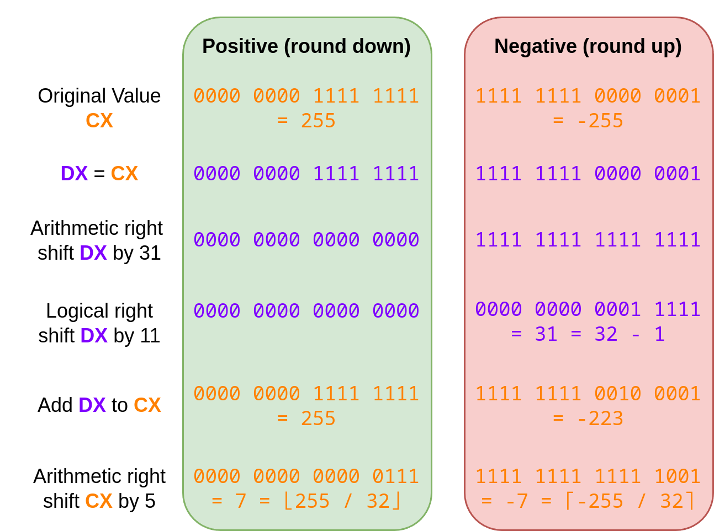

:::

So the first two right-shifts are legitimate. The third right-shift also happens in inlined functions:

`pidleput` calls the `start` function of a `limiterEvent` in `mgclimit.go`

```go showLineNumbers startLineNumber=6640 {17}
func pidleput(pp *p, now int64) int64 {
  assertLockHeld(&sched.lock)

  if !runqempty(pp) {
    throw("pidleput: P has non-empty run queue")
  }
  if now == 0 {
    now = nanotime()
  }
  if pp.timers.len.Load() == 0 {
    timerpMask.clear(pp.id)
  }
  idlepMask.set(pp.id)
  pp.link = sched.pidle
  sched.pidle.set(pp)
  sched.npidle.Add(1)
  if !pp.limiterEvent.start(limiterEventIdle, now) {
    throw("must be able to track idle limiter event")
  }
  return now
}
```
the `start` function in turn calls the `typ` function of a `limiterEventStamp`

```go showLineNumbers startLineNumber=409 {2}
func (e *limiterEvent) start(typ limiterEventType, now int64) bool {
  if limiterEventStamp(e.stamp.Load()).typ() != limiterEventNone {
    return false
  }
  e.stamp.Store(uint64(makeLimiterEventStamp(typ, now)))
  return true
}
```
which in turn uses a right-shift to extract the `limiterEventType` from the `limiterEventStamp`.

```go showLineNumbers startLineNumber=390 {2}
func (s limiterEventStamp) typ() limiterEventType {
  return limiterEventType(s >> (64 - limiterEventBits))
}
```

So this rightshift is legitimate as well.

##### Matched numbers

So far nothing suspicious, maybe the magic numbers are though?

The first number `0x3F` which is usually used in modulo 64 calculations is at address `0x4436A1` which is another inlined function. The call chain is as follows again:

We begin by calling `start` of the `limiterEvent`.

```go showLineNumbers startLineNumber=6640 {17}
func pidleput(pp *p, now int64) int64 {
  assertLockHeld(&sched.lock)

  if !runqempty(pp) {
    throw("pidleput: P has non-empty run queue")
  }
  if now == 0 {
    now = nanotime()
  }
  if pp.timers.len.Load() == 0 {
    timerpMask.clear(pp.id)
  }
  idlepMask.set(pp.id)
  pp.link = sched.pidle
  sched.pidle.set(pp)
  sched.npidle.Add(1)
  if !pp.limiterEvent.start(limiterEventIdle, now) {
    throw("must be able to track idle limiter event")
  }
  return now
}
```

Notice that we passed `limiterEventIdle`, a constant with a value of 3 to `start`:

:::fold[limiterEvents]

```go showLineNumbers startLineNumber=350 {6}
const (
  limiterEventNone           limiterEventType = iota // None of the following events.
  limiterEventIdleMarkWork                           // Refers to an idle mark worker (see gcMarkWorkerMode).
  limiterEventMarkAssist                             // Refers to mark assist (see gcAssistAlloc).
  limiterEventScavengeAssist                         // Refers to a scavenge assist (see allocSpan).
  limiterEventIdle                                   // Refers to time a P spent on the idle list.

  limiterEventBits = 3
)
```

:::

Next the `start` function calls `makeLimiterEventStamp`, passing the previous `limiterEventIdle` constant:

```go showLineNumbers startLineNumber=409 {5}
func (e *limiterEvent) start(typ limiterEventType, now int64) bool {
  if limiterEventStamp(e.stamp.Load()).typ() != limiterEventNone {
    return false
  }
  e.stamp.Store(uint64(makeLimiterEventStamp(typ, now)))
  return true
}
```

The `makeLimiterEventStamp` function is now where our magic number `0x3F` was reported.

```go showLineNumbers startLineNumber=371 {2}
func makeLimiterEventStamp(typ limiterEventType, now int64) limiterEventStamp {
  return limiterEventStamp(uint64(typ)<<(64-limiterEventBits) | (uint64(now) &^ limiterEventTypeMask))
}
```
There is no value of 63 here though? This magic number only becomes apparent once you replace the constant values `typ` and `limiterEventBits` and understand what the compiler is doing.

`typ` has the value `limiterEventIdle`, so 4. \
`limiterEventBits` has a value of 3.

Meaning our snippet gets evaluated by the compiler like follows:

```go
limiterEventStamp(uint64(typ)<<(64-limiterEventBits)
// replace the constant names with values
limiterEventStamp(uint64(4)<<(64-3)
// subtract the 3 from 64
limiterEventStamp(uint64(4)<<(61)
// which is equivalent to
limiterEventStamp(uint64(1<<2)<<(61)
// which is equivalent to
limiterEventStamp(uint64(1<<63)
```

And that is exactly what the compiler then does. Setting the bit at position 63 (0-indexed) of our 64-bit integer using the *Bit Test and Set QuadWord* instruction :
```go
BTSQ $0x3f, DX
```

As for the number `0x3D`, which might be an ASCII equal-sign (`=`) used for padding in base64, it's the same story.
Just replace the `limiterEventBits` with 3 again and you get the value 61 in the `typ` function
```go showLineNumbers startLineNumber=409
func (s limiterEventStamp) typ() limiterEventType {
  return limiterEventType(s >> (64 - limiterEventBits))
}
```

which is what the compiler uses:
```go
SHRQ $0x3d, DX
```

So no, the magic number values aren't suspicious either. I think it is now safe to say that what capa matched here was a false positive.

#### **encode data using XOR**

This is what capa reported for XOR encoding:

```text
encode data using XOR
namespace  data-manipulation/encoding/xor
author     moritz.raabe@mandiant.com
scope      basic block
att&ck     Defense Evasion::Obfuscated Files or Information [T1027]
mbc        Defense Evasion::Obfuscated Files or Information::Encoding-Standard Algorithm [E1027.m02], Data::Encode Data::XOR [C0026.002]
basic block @ 0x40622D in function 0x406140
  and:
    characteristic: tight loop @ 0x40622D
    characteristic: nzxor @ 0x406231, 0x406247, 0x406251, 0x406266, and 60 more...
    not: = filter for potential false positives
      or:
        or: = unsigned bitwise negation operation (~i)
          number: 0xFFFFFFFF = bitwise negation for unsigned 32 bits
          number: 0xFFFFFFFFFFFFFFFF = bitwise negation for unsigned 64 bits
        or: = signed bitwise negation operation (~i)
          number: 0xFFFFFFF = bitwise negation for signed 32 bits
          number: 0xFFFFFFFFFFFFFFF = bitwise negation for signed 64 bits
        or: = Magic constants used in the implementation of strings functions.
          number: 0x7EFEFEFF = optimized string constant for 32 bits
          number: 0x81010101 = -0x81010101 = 0x7EFEFEFF
          number: 0x81010100 = 0x81010100 = ~0x7EFEFEFF
          number: 0x7EFEFEFEFEFEFEFF = optimized string constant for 64 bits
          number: 0x8101010101010101 = -0x8101010101010101 = 0x7EFEFEFEFEFEFEFF
          number: 0x8101010101010100 = 0x8101010101010100 = ~0x7EFEFEFEFEFEFEFF
```
It mentions a block at `0x40622D`. So we're playing the same game again:

[^1]: Taken from [https://developer.ibm.com/articles/au-dwarf-debug-format/](https://developer.ibm.com/articles/au-dwarf-debug-format/)

[^2]: Since capa's v7.0 release it technically also does dynamic analysis using the CAPE sandbox. It requires CAPE to do the dynamic analysis for it and is then able to read CAPE's report. For more details read the [dedicated blog post by Mandiant](https://cloud.google.com/blog/topics/threat-intelligence/dynamic-capa-executable-behavior-cape-sandbox/).

[^3]: The man page is provided by a third-party since Apple doesn't publish them on the web: https://github.com/manpgs/mac
