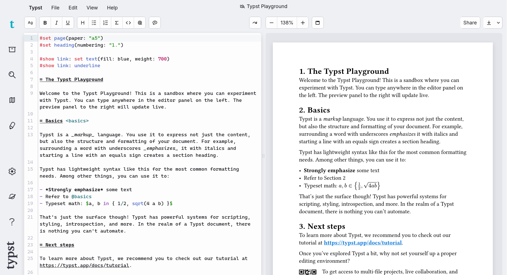
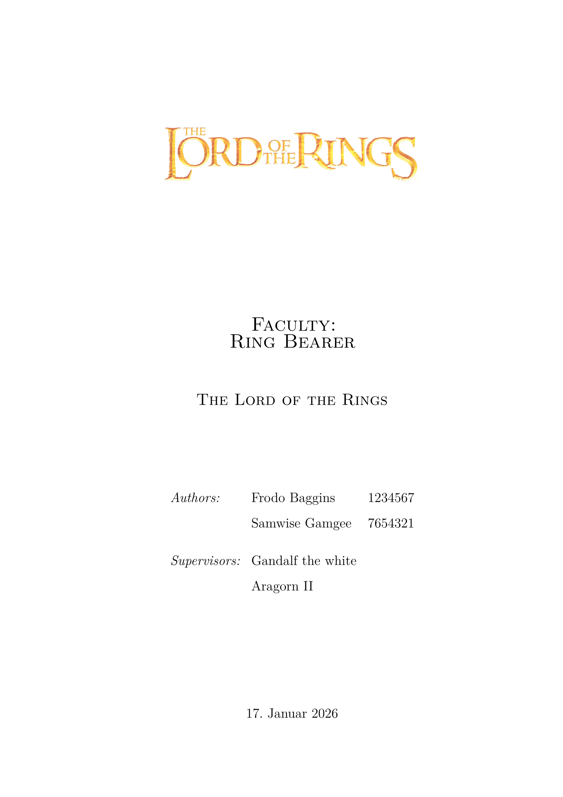
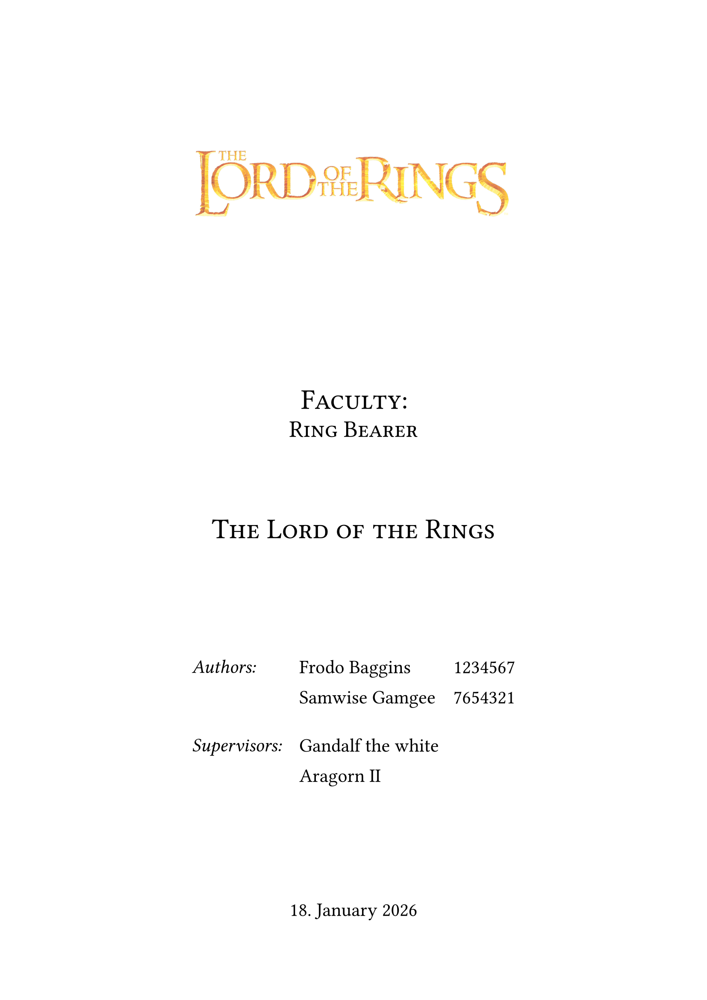
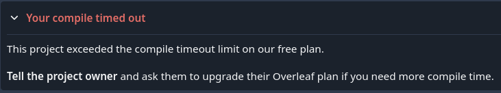
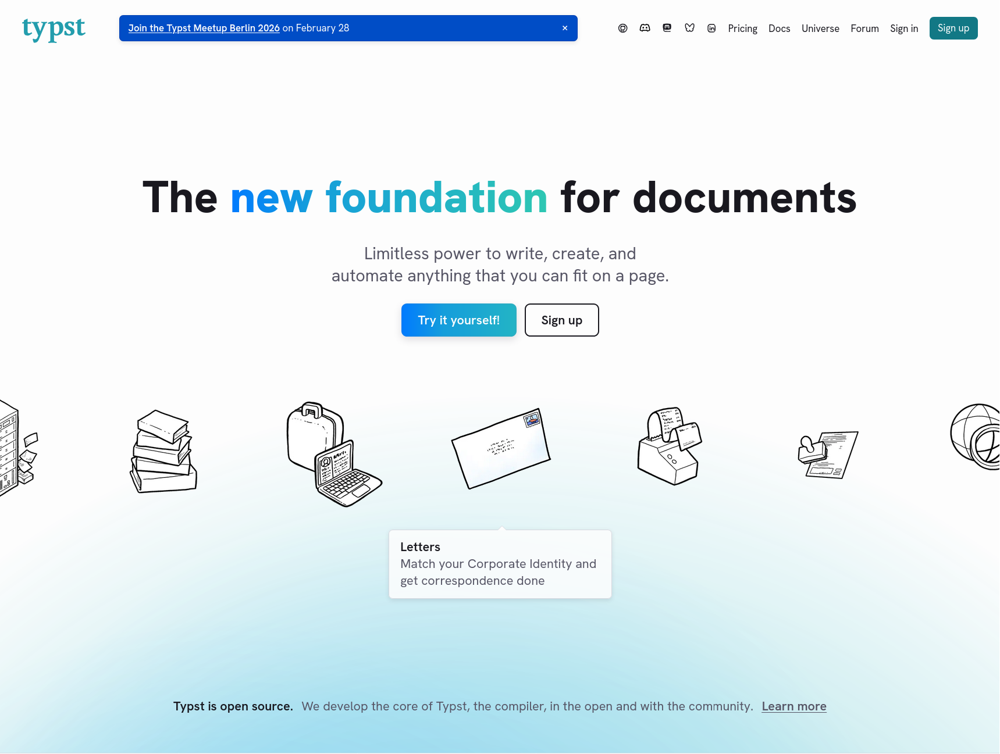
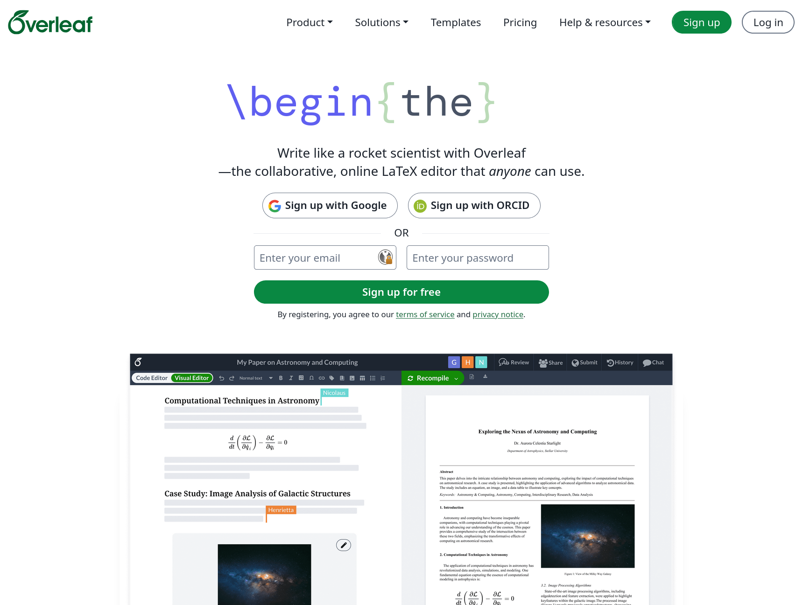
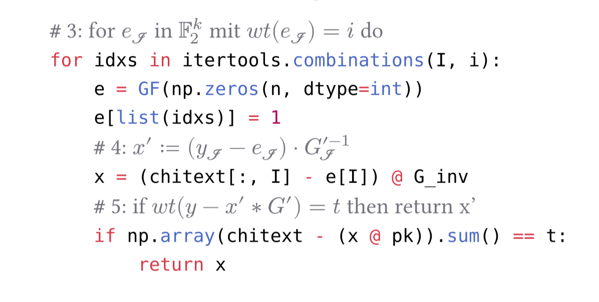

> [!TIP]
>
> :::fold[Expand this for a TLDR]
> - Typst is a modern typesetting alternative to TeX / LaTeX
> - I like it a lot!
> - Go to https://typst.app/play/ and try it.
> - Either you'll love it or you won't
> :::

Recently while fiddling with [Tectonic](https://tectonic-typesetting.github.io/en-US/),
a "self-contained TeX / LaTeX engine", Typst popped into my head.

Typst is a typesetter like TeX / LaTeX that went open source back in March 2023. I remembered reading about it
circa 2 years ago. It had a lot of missing features and problems, so I told myself I'll take a look again
somewhen in the future. I decided that time was now, so I set aside Tectonic and LaTeX for
the time being and went to the Typst Website.

*Oh, there is a "Try it yourself" button. Let's see if this brings me to a signup page.*

Nope! It brings you to the [Typst Playground](https://typst.app/play/) letting you *actually try* Typst:



And so I did. I started by deleting a paragraph and ... 

*Huh?? Did this just re-render the document in real time???* 

Yep. That is exactly what it did. **Typst has render-times in the milliseconds!**
To anyone who has ever dealt with large LaTeX documents (80+ pages) this is a huge deal.
Instead of waiting minutes until I can see the changes made to my document in rendered form,
I'd be waiting seconds at worst.

This got me hooked in an instant. And so I decided to convert an old paper from LaTeX.
This way i would learn about Typsts and it quirks and get a feeling for how "production ready" it is.
Following are the original and the converted title page (redacted, of course).

:::fold[Can you guess which one was produced by which typesetter?]
The left one was done using LaTeX, the right one using Typst.
:::

|||
|---|---|
| ||

I was very impressed with Typst. So much so, that I now personally believe that Typst is the future of Typesetting.
The reasons for that I will now outline in this blog post.

## Recompilation

Did I mention that in Typst your document updates instantly because recompilation takes basically no time at all?
This is in my opinion **the discerning feature of Typst**.
If you care about nothing else in this blog post then at least try Typst because of this.

The following is a loop I personally experience quite often:
  - tweak something in the document
  - wait for compilation
  - see it's not quite right and try again.

Using LaTeX or Typst can be the difference between 5 iterations taking 5 seconds or 2 minutes.
It lets me iterate a lot faster, so that I can now spend more time actually writing than fiddling with minute details of my document.

Also, when using online collaborative editing and sufficiently large or complex documents, compilation can stop being
an "oh no, I have to wait" problem and start becoming an "oh no, I'll have to upgrade my account problem":



Of course, you can just run the compilation and everything offline on your computer.
And of course when working with LaTeX for long enough you'll learn about things like pre-compilation
or splitting documents into multiple files which can then be excluded from compilation.

But when using Typst *you don't have to*! *If* your document compiles (Typst requires your document to be syntactically correct)
it does so **FAST**.

## Typst uses Markdown like markup

The next big difference I noticed while converting my document is the difference in markup.
Typst markup uses a lot of ideas from markup languages like Markdown.
For comparison in LaTeX everything is pretty much a macro (that's just the nature of LaTeX).

This in my opinion, makes writing Typst a lot faster, since the syntax tends to be a lot less verbose and more human-readable.
In the following I'll compare some of this markup to LaTeX.

### Headings:

If we want to write headings of different depths then we use a prefix-style heading markup.
This is essentially what markdown does too.
Instead of using number signs (`#`), like we are used to from Markdown, we use equal signs (`=`) instead:

```typst
= Heading 1
== Heading 1.1
=== Heading 1.1.1
==== Heading 1.1.1.1
===== Heading 1.1.1.1.1
```

I want a heading of depth three? Just put three equal signs in front of it.
If we compare that to the LaTeX header macros the Typst variant is a lot simpler to grasp:

```latex
\part{Heading 1} % Depending on document type
\chapter{Heading 1.1} % Depending on document type
\section{Heading 1.1.1}
\subsection{Heading 1.1.1.1}
\subsubsection{Heading 1.1.1.1.1}
```

We don't have to remember the heading names and don't have to worry if we use parts and chapters or not.

The LaTeX macros *are more explicit* though, in that when we use `\part` we are explicitly splitting our document into parts.
Every heading in Typst is a "section" and by default referred to as such.

### bold, italic and monospaced text:

Bold, italic and monospaced text also heavily borrows from Markdown.
The main difference being that the italic and bold markers (`_` and `*`) cannot be used interchangeably in Typst.

```typst
_This will be italic_
*This will be bold*
`This will be monospaced`
```

If we compare that to LaTeX we see that we have use macros again.

```latex
\textit{This will be italic}
\textbf{This will be bold}
\texttt{This will be monospaced}
```

One could argue that the macro names `textit`, `textbf` `texttt` are easier to understand since they explicitly tell you what they mean.
Though in the age of language aware editors, I don't think this still is a big problem. 
Your editor can display the text as it is formatted, allowing us to understand the markups meaning at a glance.

This way we don't need explicit names anymore. They might even register as noise when reading.
Compare the readability of some the LaTeX/Typst source when we nest some of these modifiers:

```latex
\texttt{Hello}, I am a \textit{sentence that uses \textbf{nested} macros}.
```

```typst
`Hello`, I am a _sentence that uses *nested* macros_.
```

### Links / URLs:

One of the Markdown syntaxes Typst luckily didn't adopt is Markdown's ugly URL syntax `[]()`
Instead, this is how you put a clickable link into your Typst document:

```typst
Here is my blog: https://gelaechter.github.io/
```

No, I didn't forget any special syntax, *Typst just doesn't need any*. It detects links on its own.
LaTeX is quite the opposite. It doesn't support clickable links at all util you use the `hyperref` package.
Then you have to use a macro again:

```latex
\usepackage{hyperref}
Here is my blog: \url{https://gelaechter.github.io/}
```

You might have noticed a pattern here,
where markup in Typst does something that LaTeX has to solve via macros,
thus making it more verbose.
This problem is only amplified with environment macros:

### Code snippets:

A code snippet in Typst uses Markdown syntax.
Three backticks and a language specifier to start the code block and three backticks to end it:

``````typst
```python
print("Hello World!")
```
``````

Pretty straight forward (if you know markdown that is).

LaTeX in comparison firstly again requires the use of a package,
and secondly the use of an environment which starts with a `\begin` and ends with an `\end`.
In the following they mark the "minted" environment which highlights code:

```latex
\usepackage{minted}
\begin{minted}{python}
print("Hello World!")
\end{minted}
```

In this case a single environment takes only little effort and makes for pretty legible source code.
When comparing the list/enumeration syntax though, this can get out of hand quickly:

### Lists

To recreate these two lists:

- Item
  - Sub-Item
  - another Sub-Item
- another Item

1. Item 1
    1. Item 1.1
    2. Item 2.2
2. Item 2

This, is what we have to do in LaTeX:

```latex
\begin{itemize} % Unordered
    \item Item \begin{itemize}
        \item Sub-Item
        \item another Sub-Item
    \end{itemize}
\item another Item
\end{itemize}

\begin{enumerate} % Ordered
    \item Item 1 \begin{enumerate}
        \item Item 1.a % Latex uses letters for "sub-enumerations"
        \item Item 1.b
    \end{enumerate}
    \item Item 2
\end{enumerate}
```

This time we have to create *A LOT* of these environments.
This takes effort and makes the source code less legible.

Typst on the other hand again just uses Markdown like syntax.
Allowing us to simply define these lists like this:

```typst
- Item // Unordered
    - Sub-Item
    - another Sub-Item
- another Item

+ Item 1 // Ordered
    + Item 1.1
    + Item 1.2
+ Item 2
```

The pluses (`+`) allow us to define ordered lists where the numbering is automatically applied.

## Typst is "batteries included"

While I could keep talking about Typst's markup
([citations](https://typst.app/docs/reference/model/cite/),
[references](https://typst.app/docs/reference/model/ref/),
[terms / LaTeX descriptions](https://typst.app/docs/reference/model/terms/), etc.)
I now want to talk about Typsts included features.

"Batteries included" is the motto of the Python programming language.
It means that Python has many of the modules that you could need already included 
in the language itself.

When compared to LaTeX, Typst feels similar.
Again, this is because Typst was designed with years of LaTeX usage in mind.
The Typst developers know what we expect of a typesetter, while LaTeX had to grow "organically".

Here are some LaTeX packages I'd include in a typical document:

- *babel* for setting document language
- *biblatex* to create a bibliography
- *minted* to highlight code snippets
- *csquotes* to support smart quotation marks (`" "` to `“ ”`)
- *fontenc* to encode symbols like ö or á as a single character that our font can then look up.
- *geometry* to set page size and margins
- *float* to position figures and the like equivalent to where they are in the LaTeX source.

And these are just a few select. My original LaTeX document uses *31 packages*.
For my Typst conversion of the document I didn't use a single one **because Typst already includes these features**.

An important side effect of this is that you don't need to decide on which solution to choose when you need some functionality.
This can be especially cumbersome since LaTeX has such a long history.
For every problem you have there are about a dozen packages promising a solution, often superseding another.
So you end up in situations like:

*I need to create a table, which package (if any) should I use?*

 - the built-in *tabular* environment?
 - the *tabularx* package?
 - the newer *tabulary* package?
 - or maybe just the *array* package?
 - or maybe even the *multirow* package?
 - or do I need the *longtable* package?

And I'm sure that someone somewhere will tell me that all of these are actually wrong,
and I should be using *multilongtabulararrayxyz* instead because that is the package
[works for all my use cases](https://xkcd.com/927/).

So by just giving you the tools you need, Typst saves a lot of your time otherwise spent
reading old TeX Stack Exchange posts about possible solutions to your problem.

> [!TIP]
> By the way, Typst of course still offers packages through the "[Typst Universe](https://typst.app/universe)",
for whenever basic Typst isn't enough.

{/*
## Typst.app

Typst.app is Typst's official homepage owned by Typst incorporated.
It contains the official Typst documentation, the *Typst Universe*, which holds the Typst packages and templates, the Typst Forum as well as the an Typst online editor.

The closest thing we have to this in the LaTeX world is Overleaf owned by Digital Science UK Limited.
Overleaf is a collaborative online LaTeX editor.
They also templates, as well as a documentation section containing basic and advanced LaTeX tutorials.

### First impressions

So if you're new to LaTeX this is probably one of the first websites you're going to visit.
Remember what I said about the "Try it yourself!"-Button?
Let's compare the landing page of typst.app to the one of overleaf.com:

|||
|---|---|
| |  |

What will a user need to do to try Typst? Click on "Try it yourself!",
you now have an editor open and can try Typst.

What will a user need to do to try LaTeX, well either you sign up at Overleaf,
or alternatively look for another website that renders LaTeX online,
or maybe even install the LaTeX tooling locally and then compile your document yourself.

This isn't exactly a point for *Typst the typesetter* but I deem it noteworthy nonetheless.

### Everything in one place

After all these years whenever you have a need for something in LaTeX you usually already know where to look:

| Need | Place |
|---|---|
| Online editor | Overleaf |
| Templates | Overleaf |
| Basic documentation | Overleaf |
| Comprehensive documentation | LaTeX Project Website |
| Packages \& their documentation | CTAN |
| Forum | Tex Stack Exchange |

And while Overleaf has honestly done a great job unifying a few of these (especially their documentation),
Typst.app has positioned itself to be a one-stop shop for all things Typst.

| Need | Place |
|---|---|
| Online Editor | Typst.app |
| Templates | Typst.app (Universe) |
| Basic Documentation | Typst.app (Docs) |
| Comprehensive Documentation | Typst.app (Docs) |
| Packages & their documentation | Typst.app (Universe) |
| Forum | Typst.app (Forum) or the Typst GitHub |

### Editing experience

Now there are two more things i never knew i missed in Overleaf as an editor.
*/}

## Typst math defaults to conventional choices

This might be a good or a bad thing depending on what you like but the way you do mathematical notation
in Typst feels very implicit when compared to LaTeX, meaning it is often less verbose and faster to type.

Let's imagine you want to create a fraction such as this:

$$
\frac{1}{2}
$$

LaTeX makes no assumptions. If you want a fraction you have to *tell* LaTeX using the `\frac` macro.

Typst however goes the other way around simply allows you to write `1/2`,
like I would in a plain text file for example.

Typst's mathematical syntax makes these kinds of assumptions what a user usually wants to do.
And since in math fractions are used more often than a slash-notation ($1/2$)
the math syntax makes the slash the explicit choice by escaping it (`1\/2`).

This is a pattern that continues through Typst's math syntax. `1^22` actually renders $1^{22}$,
while in LaTeX we'd have to explicit state that the second `2` also belongs into the exponent
by grouping them using curly braces (`1^{22}`).

Here are some more example expressions:

|Equation|Latex|Typst|
|:-:|---|---|
|$$1 \frac{1}{2}$$|`1 \frac{1}{2}`|`1 1/2`|
|$$\frac{11}{2}$$|`\frac{11}{2}`|`11/2`|
|$$13 \le x$$|`13 \le x`|`13 <= x`|
|$$\pi \in \mathbb{R}$$|`\pi \in \mathbb{R}`|`pi in RR`|
|$$\text{Split} \cdot \text{Words}$$|`\text{Split} \cdot \text{Words}`|`"Split" dot "Words"`

And these simplifications become more important the more we try to denote.
If we want to write a matrix like this:
$$
\begin{pmatrix}
1 & 2 & \ldots & 10 \\
2 & 2 & \ldots & 10 \\
\vdots & \vdots & \ddots & \vdots \\
10 & 10 & \ldots & 10
\end{pmatrix}
$$

In LaTeX we do the following.

```latex
$$
\begin{pmatrix}
1 & 2 & \ldots & 10 \\
2 & 2 & \ldots & 10 \\
\vdots & \vdots & \ddots & \vdots \\
10 & 10 & \ldots & 10
\end{pmatrix}
$$
```

The Typst equivalent looks like this:

```typst
$ mat(
  1, 2, dots, 10;
  2, 2, dots, 10;
  dots.v, dots.v, dots.down, dots.v;
  10, 10, dots, 10;
) $
```

But don't worry, if you don't have time to get used to, or simply dislike, the new math syntax.
You can [keep using LaTeX math in Typst](https://typst.app/universe/package/mitex), with all the other benifits that Typst brings you.

## Typst is a programming language

Finally I want to talk about another big selling point for me personally.

Unlike LaTeX which is system of macros built on top of TeX, Typst contains what is essentially a functional programming language.
For me with a programming background this is very interesting.
And considering that a sizeable chunk of LaTeX users are computer scientists, I believe this to be of interest for many others.

> [!WARNING]
> Programmer ramblings ahead. If you don't care about programming, feel free skip to the [conclusion](#conclusion)

**Everything in Typst is data.** Booleans, Bytes, Floats, Integers, Functions, Strings or Content.
Pretty much everything in Typst is represented by a type which we can store in **variables**
and manipulate through **functions**. This is a clear difference to LaTeX, which treats everything
as a *token* and makes changes to these using macros which are expanded into more tokens (or macros).

**Typst also supports structuring this data.** There are arrays and dictionaries.
Arrays being a list of data. And dictionaries being structured data where a key stores a value
(like I would look up the translation (value) for a word (key) in a dictionary).

This means I can create a variable `authors` where an author is a dictionary containing
a name, a student ID, and their signature (`image` is a function which returns `content`;
the content being a rendered image for the given path).

```typst
// This is a comment, Typst ignores these
#let authors = ( // Here begins the list
  ( // Here begins a dictionary for author 1
    name: "Frodo Baggins",
    stud_id: "1234567",
    signature: image("signatures/frodo.png")
  ),
  ( // Here begins another dictionary for author 2
    name: "Samwise Gamgee",
    stud_id: "7654321",
    signature: image("signatures/samwise.png")
  ),
) // So we have a list of dictionaries
```

**Typst provides functions for working with this data.**
Do you want to extract the first name of an author?
You can take the full name and split it at the whitespace to get an array of two strings.
Then you just have to pick the first entry of your array:
```typst
#let frodo = (
    name: "Frodo Baggins",
    stud_id: "1234567",
    signature: image("signatures/frodo.png")
)

// Array of ("Frodo", "Baggins")
#let split_name = frodo.name.split()
// String "Frodo"
#let first_name = split_name.at(0)
```

**Typst lets you create functions yourself.**
This lets you repeat actions  or behavior as often as you like.
Do you often need the first name of an author? Just create a function:

```typst
#let first_name(author) = {
  autor.name.split().at(0)
}

#let who = first_name(frodo) // "Frodo"
#let me = first_name(samwise) // "Samwise"
// This assumes we also created a "samwise" variable somewhere
```

Now since Typst treats document content as a type too, we can construct content programmatically.
We can take our `authors` list, and apply our `first_name` function to each of the entries using the built-in `map` function.
This way our list of authors becomes a list of first names.

```typst
// Map transforms each entry of a list using a function and then returns a new list
#let first_names = #authors.map(first_name) // first_names is now an array ("Frodo", "Samwise")
// join "joins" a list using a chosen separator and returns Content
#first_names.join(", ") // This renders in the document as `Frodo, Samwise`
```

### Programmatic processing of content

If you are familiar with functional programming you know about these concepts I just talked about.
And since you can use all this functionality to *process document content*. This allows you to do a lot of cool things in your documents.

You can for example create a 10x10 matrix going from 1 to 100 programmatically instead of by hand:

```typst
#let row(n) = range(10).map(i => n * 10 + i + 1)
#let data = range(10).map(row)
$ mat(..data) $
```

This renders as:

$$
\begin{pmatrix}
1 & 2 & 3 & 4 & 5 & 6 & 7 & 8 & 9 & 10 \\
11 & 12 & 13 & 14 & 15 & 16 & 17 & 18 & 19 & 20 \\
21 & 22 & 23 & 24 & 25 & 26 & 27 & 28 & 29 & 30 \\
31 & 32 & 33 & 34 & 35 & 36 & 37 & 38 & 39 & 40 \\
41 & 42 & 43 & 44 & 45 & 46 & 47 & 48 & 49 & 50 \\
51 & 52 & 53 & 54 & 55 & 56 & 57 & 58 & 59 & 60 \\
61 & 62 & 63 & 64 & 65 & 66 & 67 & 68 & 69 & 70 \\
71 & 72 & 73 & 74 & 75 & 76 & 77 & 78 & 79 & 80 \\
81 & 82 & 83 & 84 & 85 & 86 & 87 & 88 & 89 & 90 \\
91 & 92 & 93 & 94 & 95 & 96 & 97 & 98 & 99 & 100
\end{pmatrix}
$$

This is a somewhat simplistic party trick, but that is of course not all that we can do.
I wrote this function for example, that renders python comments as Typst markup:

```typst
#let ap(lines) = {
  for line in lines.text.split("\n") {
    if line.match(regex("^*#")) != none {
      // Find all lines that contain comments
      let code = line.find(regex("^[^#]*#")) // Find everything before the comment
      let markup = line.find(regex("#.*")).slice(1) // Find everything after it
      raw(code, lang: "py") // Put everything before it into raw mode
      // Parse everything else as markup and inject color
      eval("#set text(fill: rgb(\"#74747d\"));" + markup, mode: "markup")
    } else {
      raw(line, lang: "py")
    }
    linebreak()
  }
}
```

So I put some Typst markup into the comments of my python code, wrap it in a code block and put into the function:
``````typst
#ap(```py
# 3: for $e_scr(I)$ in $bb(F)_2^k$ mit $w t(e_scr(I)) = i$ do
for idxs in itertools.combinations(I, i):
    e = GF(np.zeros(n, dtype=int))
    e[list(idxs)] = 1
    # 4: $x' := (y_scr(I) - e_scr(I)) dot G'_scr(I)^(-1)$
    x = (chitext[:, I] - e[I]) @ G_inv
    # 5: if $w t(y - x' * G') = t$ then return x'
    if np.array(chitext - (x @ pk)).sum() == t:
        return x
```)
``````

Et voilà, Typst renders our python comments as Markup:


There is probably a way to do this in LaTeX but definitely
not in half an hour by someone new to LaTeX and all its quirks.
(I had about 4 hours of Typst experience at this point).

Though granted I am pretty familiar with functional programming and programming in general.

If you are now curious about what other kinds of things Typst lets you do, check out the
["fun" category in the Typst Universe](https://typst.app/universe/search/?category=fun).
You'll find stuff like:
  - [Brainfuck transpilers](https://typst.app/universe/package/brain-transplant)
  - [literal Tetris](https://typst.app/universe/package/soviet-matrix)
  - and even [3D platformers](https://typst.app/universe/package/badformer)

All inside Typst which, let me remind you, is a typesetter...

## Conclusion

If while reading this you got the feeling that I dislike LaTeX, 
then that is only because I enjoy Typst so much!

I am hugely grateful for the years of sweat and love that people all over the world have put into LaTeX.
I shudder at the thought that the alternative might have been using MS Word for all my documents and papers.

And just like I said, this whole comparison is of course really unfair.
Typst has the privilege of being designed from the ground up with the knowledge of all the shortcomings of LaTeX.

And to that, add the fact that I have too little real world experience using Typst,
to tell you about all of *its* shortcomings. Since it's in active development I'm sure there are
still lots and lots of them. Like for example the ecosystem being still relatively small
([~500](https://typst.app/universe/search/?kind=packages)) in comparison to LaTeX
([~7000](https://ctan.org/)).

I do personally believe though that Typst is the future because all these design decisions make it
**a joy to use**.  And *it has to be* if Typst doesn't want to fall into obscurity since
it's attempting the Herculean task of replacing TeX / LaTeX. The battle-hardened giants that no
system could replace for the last ~50 years. 

So... give it a try: https://typst.app/play/ \
Porting over a simple document from LaTeX is a great way to get familiar with Typst.

Thanks for reading!